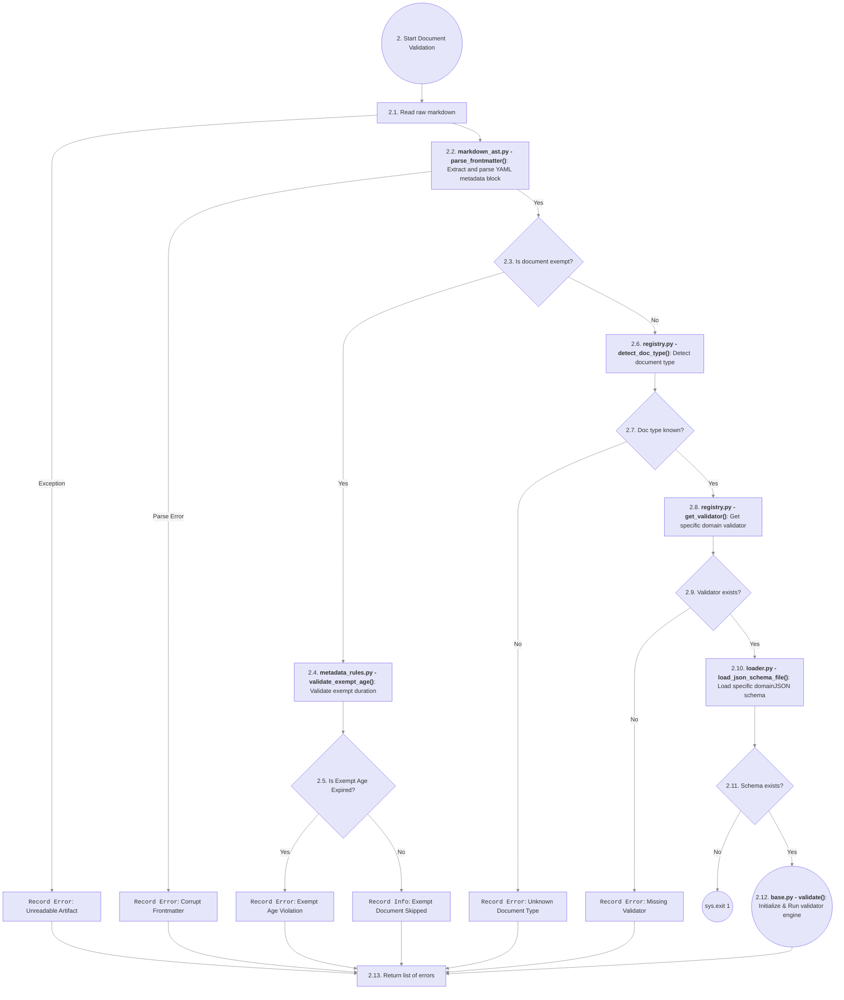
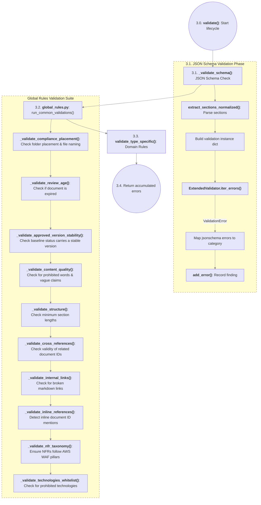
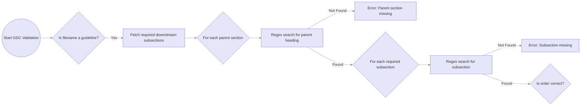
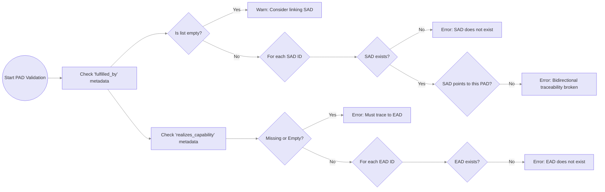
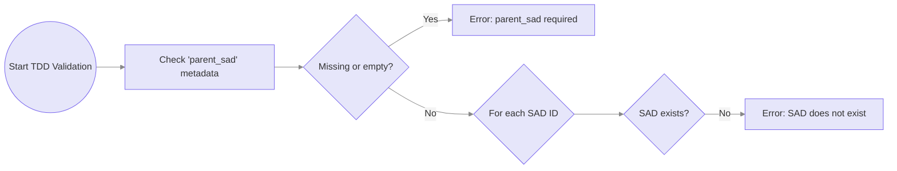
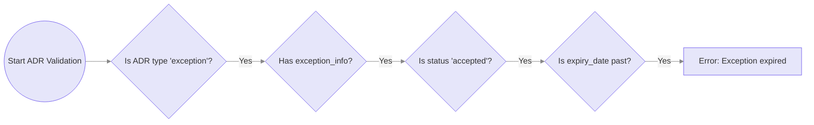
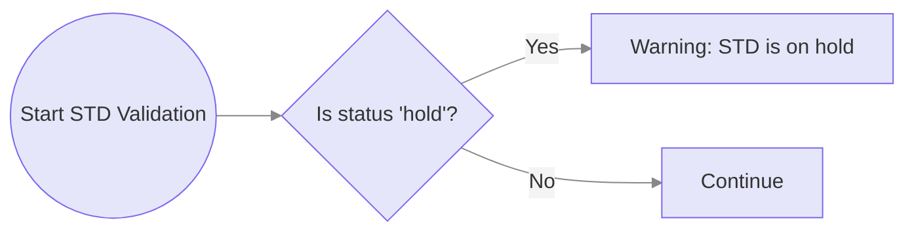

# Engine Capabilities

This index documents the internal functions and classes of the Fitness Function Engine.

> [!WARNING]
>
> **DO NOT EDIT THIS TABLE MANUALLY.** This table is automatically generated by the `update_directory_index()` function parsing the docstrings of the core auditor and validator scripts. To regenerate this block, run: `python generators/generate_functions_doc.py`

<!-- AUTO-GENERATED-FUNCTIONS:START -->

## List of functions

### `engine/control/auditors/dependency_scanner.py`

| Function                        | Description                                                                                                                                                                                                                           |
| :------------------------------ | :------------------------------------------------------------------------------------------------------------------------------------------------------------------------------------------------------------------------------------ |
| **build_dependency_graph**      | Builds a directed graph of dependencies between domains/systems. Returns: &nbsp;&nbsp;&nbsp;&nbsp;graph: dict mapping doc_id -> list of depended doc_ids. &nbsp;&nbsp;&nbsp;&nbsp;id_to_title: dict mapping doc_id -> title. |
| **find_cycles**                 | Finds all simple cycles in the directed graph.                                                                                                                                                                                        |
| **audit_circular_dependencies** | Main auditor entrypoint. Returns: &nbsp;&nbsp;&nbsp;&nbsp;list of tuples: [(filepath, level, message), ...]                                                                                                                     |

### `engine/control/auditors/git_auditor.py`

| Function               | Description                                                                                                                                                                                                                                                                                                                                      |
| :--------------------- | :----------------------------------------------------------------------------------------------------------------------------------------------------------------------------------------------------------------------------------------------------------------------------------------------------------------------------------------------- |
| **audit_version_bump** | Live repository-level version-mutation audit seam.  During the pre-baseline Governance Control Plane phase, GDCs remain draft/0.x.x, so no stable-baseline mutation policy has been admitted yet. The CLI invokes this seam on every repository audit and it intentionally returns no findings until that contract is introduced. |

### `engine/control/auditors/governance_auditor.py`

| Function                         | Description               |
| :------------------------------- | :------------------------ |
| **\_major**                      | _(No docstring provided)_ |
| **audit_architecture_admission** | _(No docstring provided)_ |

### `engine/control/auditors/graph_auditor.py`

| Function                     | Description                                                                                                                                                                                                                                                                                                                                                                                                                   |
| :--------------------------- | :---------------------------------------------------------------------------------------------------------------------------------------------------------------------------------------------------------------------------------------------------------------------------------------------------------------------------------------------------------------------------------------------------------------------------- |
| **build_upward_graph**       | Build the DAG adjacency map from registry-declared DAG relations only.                                                                                                                                                                                                                                                                                                                                                        |
| **audit_traceability_graph** | Return a list of (category, message) tuples for global traceability defects.  Currently detects circular dependencies (length >= 2) in the upward-reference graph and emits them as 'traceability_violation' (a blocking ERROR).                                                                                                                                                                                     |
| **audit_duplicate_ids**      | Evaluate duplicate document IDs across the repository to enforce the SSOT (Single Source of Truth) invariant.  This auditor iterates over the duplicate map generated during the pre-scan phase. For every duplicated ID, it generates an error tuple pointing to the conflicting file paths.  Returns: &nbsp;&nbsp;&nbsp;&nbsp;list[tuple[str, str, str]]: A list of (severity, message, filepath) tuples. |
| **audit_hierarchy_tiers**    | Enforce relationship source/target/cardinality/authority semantics from the registry.                                                                                                                                                                                                                                                                                                                                         |
| **audit_orphans**            | Enforce minimum relationship cardinality from the canonical registry.                                                                                                                                                                                                                                                                                                                                                         |

### `engine/control/auditors/registry_integrity_auditor.py`

| Function                       | Description               |
| :----------------------------- | :------------------------ |
| **\_schema_files**             | _(No docstring provided)_ |
| **\_iter_refs**                | _(No docstring provided)_ |
| **\_resolve_pointer**          | _(No docstring provided)_ |
| **\_schema_ref_findings**      | _(No docstring provided)_ |
| **\_artifact_schema_map**      | _(No docstring provided)_ |
| **\_duplicate_validator_keys** | _(No docstring provided)_ |
| **\_validator_findings**       | _(No docstring provided)_ |
| **\_target_doc_findings**      | _(No docstring provided)_ |
| **\_walk_schema_keywords**     | _(No docstring provided)_ |
| **\_custom_keyword_findings**  | _(No docstring provided)_ |
| **\_severity_findings**        | _(No docstring provided)_ |
| **\_looks_like_repo_path**     | _(No docstring provided)_ |
| **\_evidence_path_part**       | _(No docstring provided)_ |
| **\_evidence_path_exists**     | _(No docstring provided)_ |
| **\_control_findings**         | _(No docstring provided)_ |
| **audit_registry_integrity**   | _(No docstring provided)_ |
| **assert_registry_integrity**  | _(No docstring provided)_ |

### `engine/control/auditors/waiver_auditor.py`

| Function                     | Description                                                                                                                                                                                                                                                                                                                                                                 |
| :--------------------------- | :-------------------------------------------------------------------------------------------------------------------------------------------------------------------------------------------------------------------------------------------------------------------------------------------------------------------------------------------------------------------------- |
| **audit_waiver_expirations** | Validates expiration dates on all accepted Exception ADRs.  Args: &nbsp;&nbsp;&nbsp;&nbsp;all_doc_metadata (dict): Mapping of filepath to its parsed YAML frontmatter. &nbsp;&nbsp;&nbsp;&nbsp;severity_levels (dict): Mapping of SeverityRule to severity string.  Returns: &nbsp;&nbsp;&nbsp;&nbsp;list of tuples: [(filepath, level, message), ...] |

### `engine/control/config/loader.py`

| Function                             | Description                                                                                                                                                                                                                                                                                                                                                                                                                                                                                                                                                                                                                             |
| :----------------------------------- | :-------------------------------------------------------------------------------------------------------------------------------------------------------------------------------------------------------------------------------------------------------------------------------------------------------------------------------------------------------------------------------------------------------------------------------------------------------------------------------------------------------------------------------------------------------------------------------------------------------------------------------------- |
| **load_json_schema_file**            | Loads and parses a JSON schema file for the validation engine. Enforces a hard crash (exit code 1) if the mandatory schema file is missing.  <pre>Args: &nbsp;&nbsp;&nbsp;&nbsp;- schema_path (str): File path to the JSON schema.  Returns: &nbsp;&nbsp;&nbsp;&nbsp;dict: Parsed JSON schema.  Raises: &nbsp;&nbsp;&nbsp;&nbsp;FileNotFoundError: If the schema file is not found. </pre>                                                                                                                                                                                                             |
| **validate_global_config_structure** | Validates that the global governance rules configuration contains all required nested keys. Prevents silent failures when schema keys are accidentally deleted.  <pre>Args: &nbsp;&nbsp;&nbsp;&nbsp;- global_rules (dict): The x-global-config dictionary from base.schema.json.  Returns: &nbsp;&nbsp;&nbsp;&nbsp;None  Raises: &nbsp;&nbsp;&nbsp;&nbsp;RuntimeError: If a required top-level or sub-level configuration key is missing. </pre>                                                                                                                                                       |
| **validate_severity_schema**         | Validates that the provided schema severity levels comprehensively map every SeverityRule defined in the system. Ensures no configuration drift.  <pre>Args: &nbsp;&nbsp;&nbsp;&nbsp;- schema_levels (dict): Dictionary mapping rule strings to severity strings.  Returns: &nbsp;&nbsp;&nbsp;&nbsp;None  Raises: &nbsp;&nbsp;&nbsp;&nbsp;RuntimeError: If a rule is missing or unrecognized. </pre>                                                                                                                                                                                                   |
| **validate_blocking_severities**     | Validates that the provided schema blocking severities comprehensively map every BlockingSeverity defined in the system. Ensures no configuration drift.  <pre>Args: &nbsp;&nbsp;&nbsp;&nbsp;- schema_blocking (list): List of blocking severity strings from base.schema.json.  Returns: &nbsp;&nbsp;&nbsp;&nbsp;None  Raises: &nbsp;&nbsp;&nbsp;&nbsp;RuntimeError: If a severity is missing or unrecognized. </pre>                                                                                                                                                                                 |
| **parse_and_validate_global_config** | Extracts and strictly validates the global configuration from the raw JSON schema. This centralized DRY function ensures both production (cli.py) and testing (conftest.py) follow identical parsing and validation paths for global governance rules.  <pre>Args: &nbsp;&nbsp;&nbsp;&nbsp;- base_schema (dict): The raw, unparsed JSON schema loaded from base.schema.json.  Returns: &nbsp;&nbsp;&nbsp;&nbsp;tuple: (global_rules, flattened_severity_levels, blocking_severities)  Raises: &nbsp;&nbsp;&nbsp;&nbsp;RuntimeError: If the configuration is missing or structurally invalid. </pre> |

### `engine/control/framework/compatibility.py`

| Function                          | Description               |
| :-------------------------------- | :------------------------ |
| **\_python_files**                | _(No docstring provided)_ |
| **audit_ai_native_compatibility** | _(No docstring provided)_ |

### `engine/control/fs/crawler.py`

| Function                    | Description                                                                                                                                                                                                                                                                                                                                                                                                                                                                                                                                                                                                                                                                                                                                                                                                                                                                                                                                                                                                                                                                                                                                                                                                                                                                                                                                                                                                      |
| :-------------------------- | :--------------------------------------------------------------------------------------------------------------------------------------------------------------------------------------------------------------------------------------------------------------------------------------------------------------------------------------------------------------------------------------------------------------------------------------------------------------------------------------------------------------------------------------------------------------------------------------------------------------------------------------------------------------------------------------------------------------------------------------------------------------------------------------------------------------------------------------------------------------------------------------------------------------------------------------------------------------------------------------------------------------------------------------------------------------------------------------------------------------------------------------------------------------------------------------------------------------------------------------------------------------------------------------------------------------------------------------------------------------------------------------------------------------- |
| **gather_markdown_paths**   | Scans and deduplicates Markdown file paths from target directories. Deduplication here applies strictly to file paths (to handle overlapping input directories), NOT to document IDs. Enforces Fail-Closed security by strictly checking `allowed_root_dirs` and bypassing deeply nested exclusions. If `repo_root` is provided, it guarantees that only directories explicitly within the repository boundary are scanned; any external paths will trigger a hard crash.  <pre>Args: &nbsp;&nbsp;&nbsp;&nbsp;- target_dirs (str \| list): Target paths/files to scan. &nbsp;&nbsp;&nbsp;&nbsp;- repo_root (str, optional): Repository root for boundary validation. &nbsp;&nbsp;&nbsp;&nbsp;- allowed_root_dirs (set, optional): Whitelisted top-level directories. External paths &nbsp;&nbsp;&nbsp;&nbsp;&nbsp;&nbsp;trigger a hard crash.  Returns: &nbsp;&nbsp;&nbsp;&nbsp;list: Valid Markdown file paths.  Raises: &nbsp;&nbsp;&nbsp;&nbsp;SystemExit: If path traversal (e.g., `../`) or unauthorized directories are detected. </pre>                                                                                                                                                                                                                                                                                                             |
| **build_metadata_registry** | Builds a central registry of architecture documents by parsing YAML frontmatter. Enforces the SSOT (Single Source of Truth) invariant by detecting duplicate IDs. **Note**: This phase strictly GATHERS data by calling `gather_markdown_paths`. We then call `parse_frontmatter` but intentionally IGNORE any parsing errors (e.g., missing `doc_meta` or invalid YAML). This is because this phase is NOT for structural validation, its sole purpose is to build a registry to detect duplicate IDs. All other metadata validation is delegated to the main engine.  <pre>Args: &nbsp;&nbsp;&nbsp;&nbsp;- target_dirs (str \| list): Target directories to scan. &nbsp;&nbsp;&nbsp;&nbsp;- allowed_root_dirs (set, optional): Whitelisted root directories for boundary enforcement.  Returns: &nbsp;&nbsp;&nbsp;&nbsp;tuple: (unique_ids, registry, duplicates) &nbsp;&nbsp;&nbsp;&nbsp;&nbsp;&nbsp;&nbsp;&nbsp;- unique_ids (set): Discovered document IDs. &nbsp;&nbsp;&nbsp;&nbsp;&nbsp;&nbsp;&nbsp;&nbsp;- registry (dict): Maps `doc_id` to its metadata (includes `_filepath`). &nbsp;&nbsp;&nbsp;&nbsp;&nbsp;&nbsp;&nbsp;&nbsp;- duplicates (dict): Maps duplicated `doc_id` to conflicting file paths.  Raises: &nbsp;&nbsp;&nbsp;&nbsp;ValueError: If `gather_markdown_paths` detects path traversal or unauthorized boundaries. </pre> |

### `engine/control/governance/classification.py`

| Function                                | Description                                                             |
| :-------------------------------------- | :---------------------------------------------------------------------- |
| **\_load_manifest_repository_contract** | _(No docstring provided)_                                               |
| **repository_visibility_policy**        | _(No docstring provided)_                                               |
| **repository_classification_findings**  | Return blocking repository-visibility/classification boundary findings. |

### `engine/control/governance/committed_mutation.py`

| Function                                | Description               |
| :-------------------------------------- | :------------------------ |
| **CommittedMutationReport.ok**          | _(No docstring provided)_ |
| **\_default_git_runner**                | _(No docstring provided)_ |
| **\_normalize**                         | _(No docstring provided)_ |
| **\_show**                              | _(No docstring provided)_ |
| **\_parse_entry**                       | _(No docstring provided)_ |
| **audit_committed_mutation_integrity**  | _(No docstring provided)_ |
| **assert_committed_mutation_integrity** | _(No docstring provided)_ |

### `engine/control/governance/controls.py`

| Function                         | Description               |
| :------------------------------- | :------------------------ |
| **\_strip_inline_markdown**      | _(No docstring provided)_ |
| **extract_normative_statements** | _(No docstring provided)_ |
| **load_control_registry**        | _(No docstring provided)_ |
| **registry_structure_errors**    | _(No docstring provided)_ |
| **coverage_drift**               | _(No docstring provided)_ |

### `engine/control/governance/genesis.py`

| Function                      | Description                                                                             |
| :---------------------------- | :-------------------------------------------------------------------------------------- |
| **GenesisIntegrityReport.ok** | _(No docstring provided)_                                                               |
| **\_default_git_runner**      | _(No docstring provided)_                                                               |
| **\_normalize**               | _(No docstring provided)_                                                               |
| **path_matches_contract**     | _(No docstring provided)_                                                               |
| **parse_frontmatter**         | _(No docstring provided)_                                                               |
| **\_manifest_findings**       | _(No docstring provided)_                                                               |
| **validate_candidate_paths**  | _(No docstring provided)_                                                               |
| **validate_gdc_snapshot**     | _(No docstring provided)_                                                               |
| **\_load_manifest_text**      | _(No docstring provided)_                                                               |
| **\_pre_genesis_snapshot**    | _(No docstring provided)_                                                               |
| **\_post_genesis_snapshot**   | Audit Genesis from its immutable root tree, including its historical path contract.     |
| **audit_genesis_integrity**   | Validate current pre-Genesis state or immutable historical Genesis after root creation. |
| **assert_genesis_integrity**  | _(No docstring provided)_                                                               |

### `engine/control/governance/genesis_candidate.py`

| Function                            | Description               |
| :---------------------------------- | :------------------------ |
| **GenesisCandidateReport.ok**       | _(No docstring provided)_ |
| **\_default_git_runner**            | _(No docstring provided)_ |
| **\_normalize**                     | _(No docstring provided)_ |
| **\_load_manifest**                 | _(No docstring provided)_ |
| **\_lines**                         | _(No docstring provided)_ |
| **audit_genesis_commit_candidate**  | _(No docstring provided)_ |
| **assert_genesis_commit_candidate** | _(No docstring provided)_ |

### `engine/control/governance/lifecycle.py`

| Function                 | Description               |
| :----------------------- | :------------------------ |
| **lifecycle_policy**     | _(No docstring provided)_ |
| **semantic_lifecycle**   | _(No docstring provided)_ |
| **validation_profile**   | _(No docstring provided)_ |
| **lifecycle_age_policy** | _(No docstring provided)_ |
| **is_baseline_bearing**  | _(No docstring provided)_ |

### `engine/control/governance/mutation.py`

| Function                              | Description               |
| :------------------------------------ | :------------------------ |
| **MutationReport.ok**                 | _(No docstring provided)_ |
| **\_default_git_runner**              | _(No docstring provided)_ |
| **\_normalize**                       | _(No docstring provided)_ |
| **is_governed_document_path**         | _(No docstring provided)_ |
| **\_looks_versioned**                 | _(No docstring provided)_ |
| **parse_versioned_document**          | _(No docstring provided)_ |
| **validate_document_mutation**        | _(No docstring provided)_ |
| **\_candidate_paths**                 | _(No docstring provided)_ |
| **\_read_current**                    | _(No docstring provided)_ |
| **\_scan_current_documents**          | _(No docstring provided)_ |
| **\_diff_entries**                    | _(No docstring provided)_ |
| **\_show_head**                       | _(No docstring provided)_ |
| **\_audit_post_genesis_mutations**    | _(No docstring provided)_ |
| **audit_version_mutation_integrity**  | _(No docstring provided)_ |
| **assert_version_mutation_integrity** | _(No docstring provided)_ |

### `engine/control/governance/readiness.py`

| Function                         | Description               |
| :------------------------------- | :------------------------ |
| **GovernanceReadinessReport.ok** | _(No docstring provided)_ |
| **\_load_mapping**               | _(No docstring provided)_ |
| **\_normalize**                  | _(No docstring provided)_ |
| **\_temporary**                  | _(No docstring provided)_ |
| **\_permanent_path**             | _(No docstring provided)_ |
| **\_path_findings**              | _(No docstring provided)_ |
| **\_makefile_target_findings**   | _(No docstring provided)_ |
| **audit_governance_readiness**   | _(No docstring provided)_ |
| **assert_governance_readiness**  | _(No docstring provided)_ |

### `engine/control/governance/relationships.py`

| Function                           | Description               |
| :--------------------------------- | :------------------------ |
| **RelationshipSpec.cardinality**   | _(No docstring provided)_ |
| **artifact_type_from_id**          | _(No docstring provided)_ |
| **normalize_relation_values**      | _(No docstring provided)_ |
| **relationship_specs_for_source**  | _(No docstring provided)_ |
| **relationship_spec_for**          | _(No docstring provided)_ |
| **relationship_fields_for_source** | _(No docstring provided)_ |
| **dag_relation_specs_for_source**  | _(No docstring provided)_ |
| **relationship_contract_findings** | _(No docstring provided)_ |

### `engine/control/governance/scm_policy.py`

| Function                                                    | Description               |
| :---------------------------------------------------------- | :------------------------ |
| **ReviewPolicy.effective_required_approvals**               | _(No docstring provided)_ |
| **ReviewPolicy.effective_require_qualified_owner_approval** | _(No docstring provided)_ |
| **\_mapping**                                               | _(No docstring provided)_ |
| **\_keys**                                                  | _(No docstring provided)_ |
| **\_string**                                                | _(No docstring provided)_ |
| **\_bool**                                                  | _(No docstring provided)_ |
| **\_nonnegative_int**                                       | _(No docstring provided)_ |
| **\_positive_int**                                          | _(No docstring provided)_ |
| **\_string_tuple**                                          | _(No docstring provided)_ |
| **load_scm_enforcement_policy**                             | _(No docstring provided)_ |
| **assert_scm_enforcement_policy**                           | _(No docstring provided)_ |

### `engine/control/governance/scm_trust.py`

| Function                      | Description               |
| :---------------------------- | :------------------------ |
| **SCMTrustBoundaryReport.ok** | _(No docstring provided)_ |
| **\_f**                       | _(No docstring provided)_ |
| **audit_scm_trust_boundary**  | _(No docstring provided)_ |
| **assert_scm_trust_boundary** | _(No docstring provided)_ |

### `engine/control/governance/severity_enforcement.py`

| Function                               | Description               |
| :------------------------------------- | :------------------------ |
| **load_severity_enforcement_registry** | _(No docstring provided)_ |
| **\_evidence_path_exists**             | _(No docstring provided)_ |
| **severity_registry_findings**         | _(No docstring provided)_ |

### `engine/control/governance/temporal.py`

| Function                        | Description                                                                 |
| :------------------------------ | :-------------------------------------------------------------------------- |
| **parse_canonical_date**        | Parse only canonical YYYY-MM-DD governance dates.                           |
| **evaluation_date**             | Return the deterministic governance evaluation date.                        |
| **temporal_integrity_findings** | Return semantic temporal findings without duplicating schema format checks. |

### `engine/control/linting/facade.py`

| Function           | Description                                                                                                                                                                                                                                                                                                                                                                                                                                                                                                                                                                                                                                                                                                                                                                                                                                                                                                                                                                                                                                                                                                                                                                                                                                                                                                                                                                                                                                                               |
| :----------------- | :------------------------------------------------------------------------------------------------------------------------------------------------------------------------------------------------------------------------------------------------------------------------------------------------------------------------------------------------------------------------------------------------------------------------------------------------------------------------------------------------------------------------------------------------------------------------------------------------------------------------------------------------------------------------------------------------------------------------------------------------------------------------------------------------------------------------------------------------------------------------------------------------------------------------------------------------------------------------------------------------------------------------------------------------------------------------------------------------------------------------------------------------------------------------------------------------------------------------------------------------------------------------------------------------------------------------------------------------------------------------------------------------------------------------------------------------------------------------ |
| **\_disable_info** | Capture the state of any `lint_disable` governance directives from the validator.  This includes rules that the author successfully disabled (along with their justification) and CRITICAL rules that the author attempted to disable but were rejected by the engine.  <pre>Args: &nbsp;&nbsp;&nbsp;&nbsp;- validator (Any): The instantiated validator object containing tracked disable directives.  Returns: &nbsp;&nbsp;&nbsp;&nbsp;dict: A dictionary containing 'disabled' (a list of tuples: (rule_id, reason, start_line, end_line)) &nbsp;&nbsp;&nbsp;&nbsp;&nbsp;&nbsp;&nbsp;&nbsp;&nbsp;&nbsp;and 'rejected' (set of rules that could not be silenced). </pre>                                                                                                                                                                                                                                                                                                                                                                                                                                                                                                                                                                                                                                                                                                                                                               |
| **lint_file**      | Orchestrate validation for a single markdown file. This executes the core lifecycle: Read -> Parse Metadata -> Identify Type -> Validate.  <pre>Args: &nbsp;&nbsp;&nbsp;&nbsp;- file_path (str): The path to the markdown file being linted. &nbsp;&nbsp;&nbsp;&nbsp;- global_rules (dict): Global governance schema containing severity configurations. &nbsp;&nbsp;&nbsp;&nbsp;- severity_levels (dict): Pre-extracted and validated severity mappings. &nbsp;&nbsp;&nbsp;&nbsp;- blocking_severities (tuple): Pre-extracted, immutable tuple of blocking severities. &nbsp;&nbsp;&nbsp;&nbsp;- all_doc_ids (set): A set of all known document IDs across the repository. &nbsp;&nbsp;&nbsp;&nbsp;- all_doc_metadata (dict): Metadata mapping for cross-reference checks. &nbsp;&nbsp;&nbsp;&nbsp;- output_format (str, optional): Desired output format (text, json, sarif). Defaults to "text".  Returns: &nbsp;&nbsp;&nbsp;&nbsp;tuple: (errors, is_clean, has_blocking, disable_info) &nbsp;&nbsp;&nbsp;&nbsp;&nbsp;&nbsp;&nbsp;&nbsp;- errors (list): Found violations. &nbsp;&nbsp;&nbsp;&nbsp;&nbsp;&nbsp;&nbsp;&nbsp;- is_clean (bool): True if no errors were found. &nbsp;&nbsp;&nbsp;&nbsp;&nbsp;&nbsp;&nbsp;&nbsp;- has_blocking (bool): True if blocking violations were detected. &nbsp;&nbsp;&nbsp;&nbsp;&nbsp;&nbsp;&nbsp;&nbsp;- disable_info (dict): Captured `lint_disable` directives. </pre> |

### `engine/control/parsing/markdown_ast.py`

| Function                        | Description                                                                                                                                                                                                                                                                                                                                                                                                                                                                                                                                                                                                |
| :------------------------------ | :--------------------------------------------------------------------------------------------------------------------------------------------------------------------------------------------------------------------------------------------------------------------------------------------------------------------------------------------------------------------------------------------------------------------------------------------------------------------------------------------------------------------------------------------------------------------------------------------------------- |
| **\_split_frontmatter**         | Split leading YAML frontmatter without regex inference.                                                                                                                                                                                                                                                                                                                                                                                                                                                                                                                                                    |
| **parse_frontmatter**           | Parse a leading YAML frontmatter block using deterministic delimiters.  Structured frontmatter state is never inferred with regex.                                                                                                                                                                                                                                                                                                                                                                                                                                                                   |
| **parse_date**                  | Parse a governance date using the canonical temporal parser.                                                                                                                                                                                                                                                                                                                                                                                                                                                                                                                                               |
| **extract_section_contents**    | Extract all H2 (##) level sections from a markdown document. Returns a dictionary mapping the lowercased, raw heading text to its content body. Note: The heading text retains numbering. Use extract_sections_normalized for strict matching.                                                                                                                                                                                                                                                                                                                                                       |
| **clean_content_for_length**    | Remove all semantic markdown structures (YAML frontmatter, code blocks, HTML blocks) and collapse the remaining text nodes into a single flat string. Used to accurately count the substantive prose length of a document or section.                                                                                                                                                                                                                                                                                                                                                                |
| **extract_links**               | Traverse the Markdown AST to find and extract all hyperlink targets (href values). Used to validate internal repository links and prevent link rot.                                                                                                                                                                                                                                                                                                                                                                                                                                                     |
| **normalize_section**           | Normalize section name for comparison by stripping numbering.                                                                                                                                                                                                                                                                                                                                                                                                                                                                                                                                              |
| **extract_sections_normalized** | Return {section_title: section_content} for H2 sections, with any leading numbering stripped and the ORIGINAL case preserved (e.g. '## 1. Context & Scope' -> key 'Context & Scope').  This is the canonical source of section identity for JSON-Schema validation: schemas declare required/recommended sections by their Title-Case, unnumbered name, and `content_rules` run `pattern` checks against the section's text. (`extract_section_contents` lowercases the key and keeps the numeric prefix, so it can neither satisfy a `required` match nor feed content patterns.) |
| **strip_code_fences**           | Remove fenced and indented code blocks safely using AST parsing. This replaces the blocks with an equivalent number of newlines to preserve line numbering, avoiding regex false positives with nested backticks, indented blocks, or unclosed fences.  Args: &nbsp;&nbsp;&nbsp;&nbsp;content (str): The raw Markdown text to be processed.  Returns: &nbsp;&nbsp;&nbsp;&nbsp;str: The Markdown text with all code blocks replaced by blank lines.                                                                                                                                 |
| **extract_doc_id_references**   | Extract architecture document IDs referenced in prose (e.g. '(**ADR-018**)'). Code fences and frontmatter are excluded via clean_content_for_length. Returns a de-duplicated, order-preserving list.                                                                                                                                                                                                                                                                                                                                                                                                 |

### `engine/control/rendering/artifact.py`

| Function              | Description               |
| :-------------------- | :------------------------ |
| **\_required**        | _(No docstring provided)_ |
| **\_thaw**            | _(No docstring provided)_ |
| **\_semantic_digest** | _(No docstring provided)_ |
| **render_artifact**   | _(No docstring provided)_ |
| **verify_round_trip** | _(No docstring provided)_ |

### `engine/control/reporting/reporter.py`

| Function         | Description                                                                                                                                                                                                                                                                                                                                                                                                                                                                                                                                                                                                                                                                                                                                                                                                                                                                   |
| :--------------- | :---------------------------------------------------------------------------------------------------------------------------------------------------------------------------------------------------------------------------------------------------------------------------------------------------------------------------------------------------------------------------------------------------------------------------------------------------------------------------------------------------------------------------------------------------------------------------------------------------------------------------------------------------------------------------------------------------------------------------------------------------------------------------------------------------------------------------------------------------------------------------- |
| **print_errors** | Format and aggregate errors for a specific file.  <pre>Args: &nbsp;&nbsp;&nbsp;&nbsp;- file_path (str): The path to the file being linted. &nbsp;&nbsp;&nbsp;&nbsp;- errors (list[tuple[str, str]]): List of tuples containing (severity, message). &nbsp;&nbsp;&nbsp;&nbsp;- output_format (str): Desired output format (e.g., 'text', 'json', 'sarif'). Defaults to 'text'.  Returns: &nbsp;&nbsp;&nbsp;&nbsp;tuple[list[tuple[str, str]], bool, bool]: A tuple containing: &nbsp;&nbsp;&nbsp;&nbsp;&nbsp;&nbsp;&nbsp;&nbsp;1. errors: The original list of errors. &nbsp;&nbsp;&nbsp;&nbsp;&nbsp;&nbsp;&nbsp;&nbsp;2. is_clean (bool): True only when there are zero issues (no errors, no warnings). &nbsp;&nbsp;&nbsp;&nbsp;&nbsp;&nbsp;&nbsp;&nbsp;3. has_blocking (bool): True when CRITICAL or ERROR level findings exist. </pre> |
| **build_sarif**  | Convert aggregated results into a SARIF 2.1.0 document so violations surface as inline annotations on GitHub PRs (via code-scanning upload). `results` is a list of {"file": path, "errors": [(severity, message), ...]}.                                                                                                                                                                                                                                                                                                                                                                                                                                                                                                                                                                                                                                               |

### `engine/control/repository/assembler.py`

| Function                                       | Description               |
| :--------------------------------------------- | :------------------------ |
| **\_required_text**                            | _(No docstring provided)_ |
| **RepositoryAssembler.artifact_from_metadata** | _(No docstring provided)_ |
| **RepositoryAssembler.load**                   | _(No docstring provided)_ |
| **RepositoryAssembler.load_governed_corpus**   | _(No docstring provided)_ |

### `engine/control/simulation/contracts.py`

| Function                             | Description               |
| :----------------------------------- | :------------------------ |
| **\_required**                       | _(No docstring provided)_ |
| **SimulationFinding.semantic_state** | _(No docstring provided)_ |
| **SimulationReport.outcome**         | _(No docstring provided)_ |
| **SimulationReport.semantic_state**  | _(No docstring provided)_ |

### `engine/control/simulation/graph.py`

| Function           | Description               |
| :----------------- | :------------------------ |
| **\_required**     | _(No docstring provided)_ |
| **\_digest**       | _(No docstring provided)_ |
| **\_edge_state**   | _(No docstring provided)_ |
| **\_overlay**      | _(No docstring provided)_ |
| **\_cycle_nodes**  | _(No docstring provided)_ |
| **simulate_graph** | _(No docstring provided)_ |

### `engine/control/validation/contracts.py`

| Function                             | Description               |
| :----------------------------------- | :------------------------ |
| **\_required**                       | _(No docstring provided)_ |
| **ValidationFinding.semantic_state** | _(No docstring provided)_ |
| **ValidationReport.outcome**         | _(No docstring provided)_ |
| **ValidationReport.semantic_state**  | _(No docstring provided)_ |

### `engine/control/validators/base.py`

| Function                                     | Description                                                                                                                                                                                                                                                                                                                                                                                                                                                                                                                                                                                                                                                                                                  |
| :------------------------------------------- | :----------------------------------------------------------------------------------------------------------------------------------------------------------------------------------------------------------------------------------------------------------------------------------------------------------------------------------------------------------------------------------------------------------------------------------------------------------------------------------------------------------------------------------------------------------------------------------------------------------------------------------------------------------------------------------------------------------- |
| **\_get_base_schema**                        | Load and cache the global base JSON schema for document validation. Prevents redundant disk reads by storing the schema in memory upon first invocation.  Note on Error Handling: We do not wrap this in try/except because `cli.py` already loaded and validated this exact schema during its boot sequence. If an error occurs here, it means the file was deleted or corrupted mid-execution. In that impossible state, `load_json_schema_file` will correctly crash the program with a ValueError or FileNotFoundError.  <pre>Args: &nbsp;&nbsp;&nbsp;&nbsp;None  Returns: &nbsp;&nbsp;&nbsp;&nbsp;dict: The parsed JSON dictionary of the base schema. </pre> |
| **BaseValidator.\_extract_rules_and_reason** | Parses the payload of a `lint_disable` tag to extract rule IDs and an optional reason.  Args: &nbsp;&nbsp;&nbsp;&nbsp;directive_payload (str): The string inside the tag (e.g., "rule_a, rule_b (reason: waiver)").  Returns: &nbsp;&nbsp;&nbsp;&nbsp;tuple: A list of unique rule IDs and the extracted reason string (or None).                                                                                                                                                                                                                                                                                                                                                          |
| **BaseValidator.\_close_all_active_blocks**  | Drains all currently unclosed `_start` tags and commits them as finalized block coordinates. This is triggered either when a `_end` tag is encountered, or at the very end of the file (using `float('inf')` to keep the block open indefinitely).  Args: &nbsp;&nbsp;&nbsp;&nbsp;closing_line_num (float): The line number where the block ends (or infinity). &nbsp;&nbsp;&nbsp;&nbsp;unclosed_start_tags_by_rule (dict): A mapping of rule IDs to their pending (start_line, reason) tuples.                                                                                                                                                                                            |
| **BaseValidator.\_parse_lint_directives**    | Extract `<!-- lint_disable... -->` comments from the document to build an O(1) lookup table for active disables per line.  This uses an AST-driven approach: 1. `html_block` (standalone comment): Disables the rule for its own line and the next adjacent line. 2. `html_inline` (embedded comment): Disables the rule for the entire parent block (e.g. paragraph). 3. `_start` / `_end` tags: Explicitly open and close suppression blocks. 4. Validates that the suppressed `rule_id` actually exists in the schema.                                                                                                                                                               |
| **BaseValidator.add_error**                  | Record a validation finding. Resolves the severity level from global governance rules. If the rule is suppressed via a `lint_disable` directive (either block or inline), the finding is dropped UNLESS its severity is CRITICAL, in which case the disable is rejected and the finding fires anyway.  <pre>Args: &nbsp;&nbsp;&nbsp;&nbsp;- rule_id (str): The rule ID triggering the error. &nbsp;&nbsp;&nbsp;&nbsp;- message (str): The specific validation error message. &nbsp;&nbsp;&nbsp;&nbsp;- line_num (int \| None, optional): The line number where the error occurred.  Returns: &nbsp;&nbsp;&nbsp;&nbsp;None </pre>                                            |
| **BaseValidator.validate**                   | Execute the complete validation lifecycle for this document.  The lifecycle runs in three sequential phases: 1. JSON-Schema Validation: Strict structural and pattern checking based on the domain schema. 2. Global Rules Validation: Execution of governance rules applicable to all documents. 3. Domain-Specific Rules: Execution of custom rules defined in the specific subclass validator. <pre>Args: &nbsp;&nbsp;&nbsp;&nbsp;None  Returns: &nbsp;&nbsp;&nbsp;&nbsp;list[tuple[str, str]]: An aggregated list of (severity, message) error tuples. </pre>                                                                                                           |
| **BaseValidator.\_validate_schema**          | Execute JSON-Schema validation against the document's metadata block and section bodies. Translates raw jsonschema exceptions into actionable, governance-aware error messages (e.g., mapping pattern failures to missing keywords).                                                                                                                                                                                                                                                                                                                                                                                                                                                                   |
| **BaseValidator.validate_type_specific**     | Override in subclass for doc-type-specific checks.                                                                                                                                                                                                                                                                                                                                                                                                                                                                                                                                                                                                                                                           |

### `engine/control/validators/domains/adr_validator.py`

| Function                                | Description                                                                                                                                                                                                                                                                                                                                                                                                                                    |
| :-------------------------------------- | :--------------------------------------------------------------------------------------------------------------------------------------------------------------------------------------------------------------------------------------------------------------------------------------------------------------------------------------------------------------------------------------------------------------------------------------------- |
| **ADRValidator.validate_type_specific** | Execute rules specific to Architecture Decision Records (ADRs).  Enforces lifecycle rules for architecture exceptions: - If the ADR type is 'exception' and status is 'accepted', it must have a valid `expiry_date`. - If the `expiry_date` is in the past, an `exception_expired` error is raised to force a review.  <pre>Args: &nbsp;&nbsp;&nbsp;&nbsp;None  Returns: &nbsp;&nbsp;&nbsp;&nbsp;None </pre> |

### `engine/control/validators/domains/ead_validator.py`

| Function                                | Description                                               |
| :-------------------------------------- | :-------------------------------------------------------- |
| **EADValidator.validate_type_specific** | Enforce the GDC-006 implementation-agnostic EAD boundary. |

### `engine/control/validators/domains/gdc_validator.py`

| Function                                | Description                                                                                                                                                                                                                                                                                                                                                                                                                                                                                                                                                                                                                                   |
| :-------------------------------------- | :-------------------------------------------------------------------------------------------------------------------------------------------------------------------------------------------------------------------------------------------------------------------------------------------------------------------------------------------------------------------------------------------------------------------------------------------------------------------------------------------------------------------------------------------------------------------------------------------------------------------------------------------- |
| **GDCValidator.validate_type_specific** | Execute rules specific to Governance Documents (GDC).  Enforces meta-governance constraints for guideline artifacts: - If the document is a guideline (e.g., *-guideline.md), it dynamically fetches &nbsp;&nbsp;required downstream subsections from `base.schema.json`. - It strictly enforces the presence and sequential order of these subsections &nbsp;&nbsp;nested under their respective parent headings to ensure structural consistency &nbsp;&nbsp;across all domain templates (SAD, PAD, etc.).  <pre>Args: &nbsp;&nbsp;&nbsp;&nbsp;None  Returns: &nbsp;&nbsp;&nbsp;&nbsp;None </pre> |

### `engine/control/validators/domains/pad_validator.py`

| Function                                | Description                                                                                                                                                                                                                                                                                                                                                                                                                                                                                                                                                                                                                                                                                                              |
| :-------------------------------------- | :----------------------------------------------------------------------------------------------------------------------------------------------------------------------------------------------------------------------------------------------------------------------------------------------------------------------------------------------------------------------------------------------------------------------------------------------------------------------------------------------------------------------------------------------------------------------------------------------------------------------------------------------------------------------------------------------------------------------- |
| **PADValidator.validate_type_specific** | Execute rules specific to Platform Architecture Documents (PAD).  Enforces bidirectional traceability and capability realization: - Downward traceability: Validates the `fulfilled_by` field. If populated, it must reference valid SAD IDs. &nbsp;&nbsp;Additionally checks that those SADs declare this PAD as their `parent_pad` (bidirectional link). - Upward traceability: Validates the `realizes_capability` field. It is strictly mandatory and must point &nbsp;&nbsp;to a valid EAD ID in the registry, ensuring the platform architecture maps back to business capabilities.  <pre>Args: &nbsp;&nbsp;&nbsp;&nbsp;None  Returns: &nbsp;&nbsp;&nbsp;&nbsp;None </pre> |

### `engine/control/validators/domains/sad_validator.py`

| Function                                | Description                                                                                                                                                                                                                                                                                                                                                                                                                                                                               |
| :-------------------------------------- | :---------------------------------------------------------------------------------------------------------------------------------------------------------------------------------------------------------------------------------------------------------------------------------------------------------------------------------------------------------------------------------------------------------------------------------------------------------------------------------------- |
| **SADValidator.validate_type_specific** | Execute rules specific to System Architecture Documents (SAD).  Enforces upward traceability, bidirectional consistency, and activation state: - Validates the mandatory `parent_pad` field, ensuring the system maps to a recognized platform. - Checks that the referenced PAD exists in the repository. - Checks that the referenced PAD declares this SAD in its `fulfilled_by` array. - Prevents an active SAD (`draft` or `approved`) beneath a non-approved PAD. |

### `engine/control/validators/domains/std_validator.py`

| Function                                | Description                                                                                                                                                                                                                                                                                                                                                                                                                                                                                 |
| :-------------------------------------- | :------------------------------------------------------------------------------------------------------------------------------------------------------------------------------------------------------------------------------------------------------------------------------------------------------------------------------------------------------------------------------------------------------------------------------------------------------------------------------------------ |
| **STDValidator.validate_type_specific** | Execute rules specific to Standard Documents (STD).  Enforces lifecycle constraints for enterprise standards: - Checks the `status` field. If a standard is marked as 'hold' (meaning it is slated &nbsp;&nbsp;for retirement or deprecation), an `operational_stability_violation` is raised to &nbsp;&nbsp;warn implementers against adopting it for new work.  <pre>Args: &nbsp;&nbsp;&nbsp;&nbsp;None  Returns: &nbsp;&nbsp;&nbsp;&nbsp;None </pre> |

### `engine/control/validators/domains/tdd_validator.py`

| Function                                | Description                                                                                                                                                                                                                                                                                                                                                                                                |
| :-------------------------------------- | :--------------------------------------------------------------------------------------------------------------------------------------------------------------------------------------------------------------------------------------------------------------------------------------------------------------------------------------------------------------------------------------------------------- |
| **TDDValidator.validate_type_specific** | Execute rules specific to Technical Design Documents (TDD).  Enforces upward traceability: - Validates the mandatory `parent_sad` field, ensuring the technical design maps to a system architecture. - Checks that the referenced SAD actually exists in the repository registry.  <pre>Args: &nbsp;&nbsp;&nbsp;&nbsp;None  Returns: &nbsp;&nbsp;&nbsp;&nbsp;None </pre> |

### `engine/control/validators/global_rules.py`

| Function                                 | Description                                                                                                                                                          |
| :--------------------------------------- | :------------------------------------------------------------------------------------------------------------------------------------------------------------------- |
| **run_common_validations**               | Execute the suite of global governance rules (e.g. naming, review age, NFR taxonomy, traceability) that apply universally across all architecture document types. |
| **\_validate_compliance_placement**      | Validate that the document is placed in the correct macro-directory and that the filename starts with the metadata ID.                                            |
| **\_validate_content_quality**           | Ensure the content avoids prohibited boilerplate words and vague claims based on the governance constraints.                                                         |
| **\_validate_temporal_integrity**        | Enforce future-date and temporal-ordering invariants.                                                                                                                |
| **\_validate_repository_classification** | Enforce repository visibility as the real classification storage boundary.                                                                                           |

### `engine/control/validators/metadata_rules.py`

| Function                                  | Description                                                                                                                                                                                                                                                                                                                                                                                                                                                                                                                                                                                                                                                                                                                                                                                                                                                                                                                                                                                                                                                                                                                                                                                                                                                                                                                                                                                                                                                                          |
| :---------------------------------------- | :----------------------------------------------------------------------------------------------------------------------------------------------------------------------------------------------------------------------------------------------------------------------------------------------------------------------------------------------------------------------------------------------------------------------------------------------------------------------------------------------------------------------------------------------------------------------------------------------------------------------------------------------------------------------------------------------------------------------------------------------------------------------------------------------------------------------------------------------------------------------------------------------------------------------------------------------------------------------------------------------------------------------------------------------------------------------------------------------------------------------------------------------------------------------------------------------------------------------------------------------------------------------------------------------------------------------------------------------------------------------------------------------------------------------------------------------------------------------------------- |
| **validate_lifecycle_age**                | Validate only artifact-aware lifecycle age policies declared in the registry.                                                                                                                                                                                                                                                                                                                                                                                                                                                                                                                                                                                                                                                                                                                                                                                                                                                                                                                                                                                                                                                                                                                                                                                                                                                                                                                                                                                                        |
| **\_validate_review_age**                 | Check if a document's last review date exceeds the maximum allowed age, triggering a review requirement.                                                                                                                                                                                                                                                                                                                                                                                                                                                                                                                                                                                                                                                                                                                                                                                                                                                                                                                                                                                                                                                                                                                                                                                                                                                                                                                                                                             |
| **\_validate_approved_version_stability** | Enforce GDC-000 Section 2.6 item 6: a versioned artifact that has reached a baseline status MUST carry a stable Semantic Version.  GDC-000 Section 2.6 item 4 mandates Semantic Versioning, under which major version zero means the artifact is in initial development and anything may change at any time. A document declaring `approved` -- "approved for implementation", the blueprint other teams build against -- while sitting at `0.y.z` therefore says two contradictory things about the same artifact, and a reader has no way to know which one to trust.  The distinction matters at the point where it costs something. A design at 0.4.0 tells an implementer that the contract may move underneath their code; a design marked approved tells them it will not. Both readings were true of six TDDs in this ecosystem, all six of which already had code written against them.  `chartered`, `draft`, and `proposed` are deliberately not covered: `0.y.z` is exactly the right version for an artifact that is recognized or under review but not yet a baseline. `deprecated` is covered, because an artifact can only be phased out after having been the baseline -- a deprecated document at `0.y.z` never was one.  Artifacts that carry no `version` are skipped. GDC-000 Section 2.6 item 4 makes ADRs immutable snapshots rather than versioned artifacts, so there is nothing here to check. |
| **\_validate_cross_references**           | Verify registry-declared relationship targets exist in the repository.                                                                                                                                                                                                                                                                                                                                                                                                                                                                                                                                                                                                                                                                                                                                                                                                                                                                                                                                                                                                                                                                                                                                                                                                                                                                                                                                                                                                               |
| **\_validate_technologies_whitelist**     | Enforce strict whitelist technology validation based on structured metadata. Instead of full-text scanning, this rule checks the 'technologies' array in doc_meta. Every technology (and its 'base') MUST exist in the Enterprise Tech Radar. If it exists but is on HOLD, a violation is thrown.                                                                                                                                                                                                                                                                                                                                                                                                                                                                                                                                                                                                                                                                                                                                                                                                                                                                                                                                                                                                                                                                                                                                                                           |

### `engine/control/validators/registry.py`

| Function            | Description                                                                                                                                                                                                                                                                                                                                                                                                                                                                                                                              |
| :------------------ | :--------------------------------------------------------------------------------------------------------------------------------------------------------------------------------------------------------------------------------------------------------------------------------------------------------------------------------------------------------------------------------------------------------------------------------------------------------------------------------------------------------------------------------------- |
| **detect_doc_type** | Determine the architecture document type based on the explicit `id` field from the document's YAML frontmatter. Example: 'SAD-001' -> 'SAD'  <pre>Args: &nbsp;&nbsp;&nbsp;&nbsp;- meta_id (str \| None): The metadata ID parsed from the document's YAML frontmatter. &nbsp;&nbsp;&nbsp;&nbsp;- global_rules (dict): The global rules dictionary parsed from base.schema.json.  Returns: &nbsp;&nbsp;&nbsp;&nbsp;str \| None: The document type prefix (e.g. 'SAD', 'PAD') or None if unknown/invalid. </pre> |
| **get_validator**   | Return the corresponding Validator subclass for the detected document type.  Maps strings like 'SAD' to `SADValidator`, 'PAD' to `PADValidator`, etc.  <pre>Args: &nbsp;&nbsp;&nbsp;&nbsp;- doc_type (str): The document type prefix (e.g. 'SAD', 'PAD').  Returns: &nbsp;&nbsp;&nbsp;&nbsp;type[BaseValidator] \| None: The specific validator class or None if not supported. </pre>                                                                                                                        |

### `engine/control/validators/schema_extensions.py`

| Function                            | Description                                                                                                                                                              |
| :---------------------------------- | :----------------------------------------------------------------------------------------------------------------------------------------------------------------------- |
| **\_get_concept_pattern**           | Dynamically generates a regex pattern for a required subsection concept. It matches the concept as a markdown header (### Concept) or a bolded term (**Concept**). |
| **\_validate_required_subsections** | _(No docstring provided)_                                                                                                                                                |
| **\_validate_prohibited_keywords**  | _(No docstring provided)_                                                                                                                                                |

### `engine/control/validators/structure_rules.py`

| Function                         | Description                                                                                                                                                                                                                                                                                     |
| :------------------------------- | :---------------------------------------------------------------------------------------------------------------------------------------------------------------------------------------------------------------------------------------------------------------------------------------------- |
| **\_is_example_id**              | True if the referenced ID belongs to the reserved example/placeholder namespace.                                                                                                                                                                                                                |
| **\_validate_structure**         | Validate the document structural integrity, including checking minimum section content lengths.                                                                                                                                                                                                 |
| **\_validate_internal_links**    | Verify that all internal markdown links resolve to existing files in the repository to prevent link rot.                                                                                                                                                                                        |
| **\_validate_inline_references** | Detect architecture document IDs cited inline in prose (e.g. '(**ADR-018**)') that do not resolve to any document in this repository. Reported as a non-blocking WARNING because a citation may legitimately point at an external or downstream document not present in this registry. |
| **\_validate_nfr_taxonomy**      | Ensure NFRs strictly map to AWS WAF pillars (GDC-000 Section 2.4).                                                                                                                                                                                                                              |

<!-- AUTO-GENERATED-FUNCTIONS:END -->

## CLI Execution Flow

> [!NOTE]
>
> This diagram maps the exact step-by-step execution path of the core orchestrator (`cli.py`), generated automatically from inline `# @flow:` comments.

> [!WARNING]
>
> **DO NOT EDIT THIS FLOWCHART MANUALLY.** This diagram is automatically generated by the `generate_cli_flowchart()` function parsing the inline `@flow:` comments in `cli.py`. To regenerate this block, run: `python generators/generate_functions_doc.py`

```mermaid
%%{init: {'theme': 'base', 'themeVariables': {'primaryColor': '#e6e6fa', 'primaryTextColor': '#333', 'primaryBorderColor': '#7a67ee', 'lineColor': '#888', 'edgeLabelBackground': '#f4f4f4'}}}%%
graph TD
    Main(("1. Start CLI<br><b>cli.py - main()</b>")) --> ParseArgs[1.1. Parse CLI arguments]
    ParseArgs --> LoadGlobal["1.2. <b>loader.py - load_json_schema_file()</b>: Load base schema (global rules)"]
    LoadGlobal --> CheckGlobalRules{"Valid global rules?"}
    CheckGlobalRules -->|No| ExitFailGlobal((sys.exit 1))
    CheckGlobalRules -->|Yes| IsConfigValid{"Valid Global Config & Severity? </br> <b>loader.py - (validate_global_config_structure, validate_severity_schema, validate_blocking_severities)</b>"}
    IsConfigValid -->|No| ExitFailConfig((sys.exit 1))
    IsConfigValid -->|Yes| CheckCwd["1.3. <b>_validate_execution_root()</b>: Valid CWD?"]
    CheckCwd -->|No| ExitFailCwd((sys.exit 1))
    CheckCwd -->|Yes| PreScan[["1.4. <b>crawler.py - build_metadata_registry()</b>: Collect Document Metadata from all files & validate unique IDs"]]
    PreScan -->|executes| StartRegistry
    StartRegistry(("Start")) --> GatherDocs["<b>crawler.py - gather_markdown_paths()</b>: Enforce boundary & collect markdown paths within governed boundaries"]
    GatherDocs -->|File Error: Outside Repo / Unauthorized / Cross-Drive| ExitFailPreScan((sys.exit 1))
    GatherDocs -->|Valid File Path| CheckRegIgnore{"Is Ignored File?"}
    CheckRegIgnore -->|"Yes (Skip)"| GatherDocs
    CheckRegIgnore -->|"No (Keep)"| LoopRegFile{"Iterate file paths to build Registry"}
    LoopRegFile -->|Valid Markdown| ParseYamlReg["<b>markdown_ast.py - parse_frontmatter()</b>: Extract and parse YAML metadata block"]
    ParseYamlReg -->|Parse Error| LoopRegFile
    ParseYamlReg -->|Success| CheckDups{"Is Document ID already registered?"}
    CheckDups -->|Yes| RecordDup["Store Duplicate in Registry"]
    CheckDups -->|No| RecordReg["Store Metadata in Registry"]
    RecordDup --> LoopRegFile
    RecordReg --> LoopRegFile
    LoopRegFile -->|Done Iterating| ReturnRegistry[Return Metadata Registry and Duplicate Records]
    ReturnRegistry --> ValidateTechRadar["1.5. <b>jsonschema.validate()</b>: Validate Tech Radar data against its JSON Schema"]
    ValidateTechRadar -->|Validation Error| RecordErrRadar["<code>Record Error</code>: Tech Radar Schema Violation"]
    RecordErrRadar --> FindTarget
    ValidateTechRadar --> FindTarget["1.6. <b>crawler.py - gather_markdown_paths()</b>: Gather markdown paths from CLI target arguments"]
    FindTarget -->|File Error: Outside Repo / Unauthorized / Cross-Drive| ExitFailFindTarget((sys.exit 1))
    FindTarget --> |Valid File Path| CheckFilter{"Is ignored file?"}
    CheckFilter -->|"Yes (Skip)"| FindTarget
    CheckFilter -->|"No (Keep)"| LoopFile{"1.7. Iterate file paths"}
    LoopFile --> CheckDepth{"Exceeds maximum directory depth?"}
    CheckDepth -->|Yes| RecordDepthError["<code>Record Error</code>: Directory Depth Violation"]
    RecordDepthError --> LoopFile
    CheckDepth -->|No| LintFileSub[["1.8. <b>lint_file()</b>: Validate markdown document against base schema and specific domain schema"]]
    LintFileSub -->|executes| StartLinting(("Start Linting"))
    LintFileSub --> LoopFile
    LoopFile -->|Done Iterating| RepoAudit["1.9. <b>audit_*()</b>: Run repository-level audits"]
    RepoAudit --> Reporter["1.10. <b>build_sarif()</b>: Generate output format (SARIF/JSON/Text)"]
    Reporter --> HasBlockErr{"1.11. Has blocking errors?"}
    HasBlockErr -->|Break Glass| ExitSuccess((sys.exit 0))
    HasBlockErr -->|Yes| ExitFail((sys.exit 1))
    HasBlockErr -->|No| ExitSuccess((sys.exit 0))
```

<!-- AUTO-GENERATED-CLI-FLOW:START -->

<!-- AUTO-GENERATED-CLI-FLOW:END -->

## Lint File Subroutine (cli.py)

> [!NOTE]
>
> This diagram details the execution of the `lint_file` subroutine (Step 1.8).

> [!WARNING]
>
> **DO NOT EDIT THIS FLOWCHART MANUALLY.** This diagram is automatically generated by the `generate_lint_flowchart()` function parsing the inline `@flow-lint:` comments in `cli.py`. To regenerate this block, run: `python generators/generate_functions_doc.py`

<!-- AUTO-GENERATED-LINT-FLOW:START -->

<!-- AUTO-GENERATED-LINT-FLOW:END -->

## Validation Engine Lifecycle (base.py)

> [!NOTE]
>
> This diagram maps the internal execution of `validate()`, detailing how the JSON Schema and governance rules are applied.

> [!WARNING]
>
> **DO NOT EDIT THIS FLOWCHART MANUALLY.** This diagram is automatically generated by the `generate_validator_flowchart()` function parsing the inline `@flow-validator:` comments. To regenerate this block, run: `python generators/generate_functions_doc.py`

<!-- AUTO-GENERATED-VALIDATOR-FLOW:START -->

<!-- AUTO-GENERATED-VALIDATOR-FLOW:END -->

## Domain-Specific Validation Lifecycles

> [!NOTE]
>
> These diagrams map the isolated execution flow for each specific domain validator (e.g., SAD, PAD) inside the `validate_type_specific()` step.

> [!WARNING]
>
> **DO NOT EDIT THIS FLOWCHART MANUALLY.** This diagram is automatically generated by the `generate_domain_flowcharts()` function parsing the inline `@flow-domain:` comments. To regenerate this block, run: `python generators/generate_functions_doc.py`

<!-- AUTO-GENERATED-DOMAIN-FLOWS:START -->

### GDC Validator (`gdc_validator.py`)

### PAD Validator (`pad_validator.py`)

### TDD Validator (`tdd_validator.py`)

### ADR Validator (`adr_validator.py`)

### STD Validator (`std_validator.py`)

<!-- AUTO-GENERATED-DOMAIN-FLOWS:END -->
