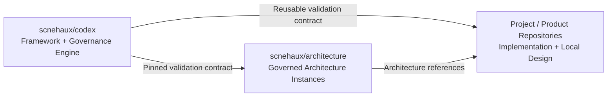
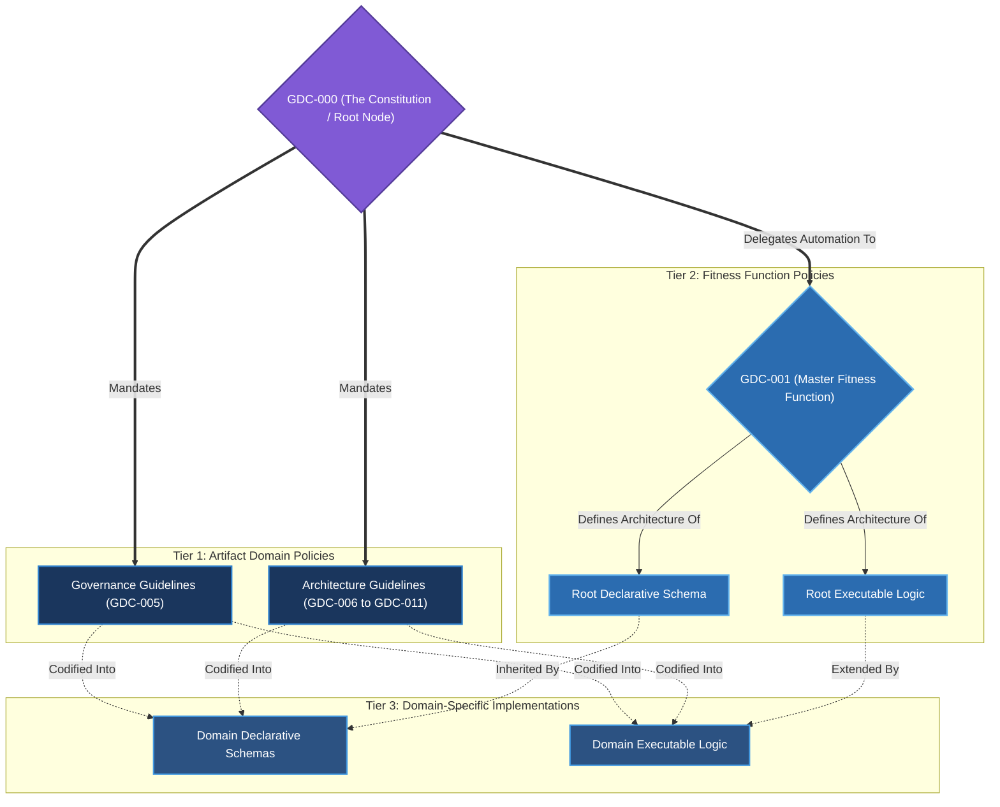
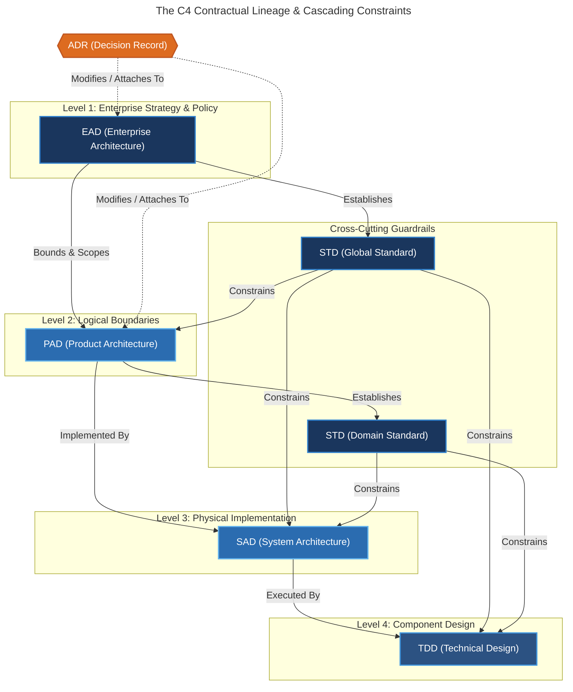
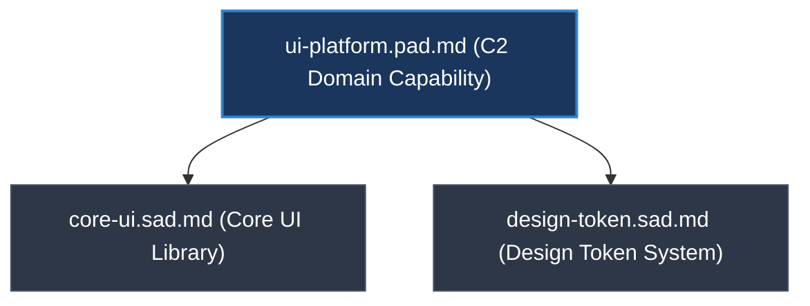

---
doc_meta:
  id: GDC-000
  title: Documentation Governance Policy
  owner: Architecture Authority
  version: 0.1.0
  status: draft
  classification: public
  governed_by: [GDC-000]
  review_cycle_days: 365
  created_date: 2026-01-01
---

# Documentation Governance Policy (The Constitution)

## 1. Context & Scope

### 1.1 The Ecosystem Goals

This Constitution is not designed to create bureaucracy, it is designed to systematically eliminate it. The strict governance framework established herein exists to guarantee five absolute organizational outcomes, strictly ordered by priority:

1. **Engineering Velocity at Scale (Decentralized Autonomy)** To allow a hyperscale engineering organization to move with the agility of a lean startup. Teams must have the autonomy to make rapid local decisions without centralized bottlenecks, while still guaranteeing absolute compliance with global enterprise standards.

2. **Architectural Integrity & Consistency (Lineage & Adaptability)** To prevent "spaghetti architecture" and fragmented technology stacks. Every system and decision must trace perfectly back to a validated business strategy. This ensures clear _blast radii_, allowing the enterprise to rapidly adapt, pivot, or replace technologies without triggering cascading failures.

3. **The Federated Single Source of Truth (Living Documentation)** To cure the inherent chaos of undocumented hyperscale engineering. The organization must possess a definitive source of truth that never lies, never rots, and is never overwhelming to read. It must provide absolute clarity on system boundaries and integration contracts at all times.

4. **Institutional Resilience (Anti-Brain Drain)** To decouple the survival of the architecture from the individuals who built it. The context, rationale, and historical evolution of every system must be permanently preserved, ensuring the organization survives human turnover without losing critical engineering knowledge.

5. **Frictionless Developer Experience (DevEx)** To ensure widespread adoption by integrating governance directly into existing engineering habits. The governance process must become an invisible, frictionless part of the daily engineering workflow rather than a bureaucratic hurdle or a separate administrative chore.

### 1.2 Core Philosophy (The Existential Maxims)

To guarantee the five Ecosystem Goals above, this architecture operates on a radical departure from traditional models. We do not write documentation, we engineer **Knowledge as Infrastructure**. To achieve absolute Architectural Integrity and Resilience, the framework is governed by seven absolute philosophical maxims:

1. **Predictability over Cleverness**: Serving as _The Goal_ of this ecosystem, software architecture, documentation, and governance processes must be deterministic. We reject "clever" system hacks, bespoke documentation formats, and subjective policy enforcement in favor of boring designs, rigidly standardized structures, and mechanically verifiable policies.
2. **Strict Separation of Concerns (SoC)**: To provide _The Structure_ for predictability, architectural responsibilities must be ruthlessly isolated across all layers (Fractal Abstraction). Every artifact has a strictly bounded perimeter. We decouple logical intent ("What we do") from physical execution ("How we do it") across the entire ecosystem so that downstream engineering refactors do not pollute upstream strategic artifacts.
3. **Explicit Contracts (Boundaries over Prose)**: Acting as _The Connective Tissue_ between those separated concerns, we do not strive for exhaustive conceptual dictionaries. Instead, we demand explicit contracts at the boundaries. Critical integration points, such as document identity (YAML Frontmatter), structural schemas (JSON), API interfaces, trust boundaries, failure modes, NFR targets, and ownership, must be explicitly quantified. Hand-wavy assumptions in these critical areas are prohibited.
4. **Docs-as-Code (Immutable History)**: Providing _The Medium_ for these contracts, architecture documentation is treated identically to source code. It lives in Git, where every change is locked into an immutable commit hash. After the one-time Genesis Bootstrap defined in Section 2.6.1, every change requires a Pull Request, undergoes peer review, and is validated by CI/CD pipelines. Un-auditable platforms (like Wikis or Word documents) are prohibited because they lack cryptographic traceability.
5. **Zero Waste (The Deletion Mandate)**: Dictating _The Lifecycle_ of the medium, redundancy breeds entropy in both architectural and governance artifacts. We enforce a strict Single Source of Truth (SSOT) through centralized definitions and decentralized references. Execution-level artifacts that rot quickly must be aggressively deleted once built, and duplicated governance policies must be ruthlessly consolidated. We rely on Git history for forensic audits rather than accumulating dead archives.
6. **Policy-as-Code & Deterministic Enforcement**: Acting as _The Enforcer_ of these laws, a governance policy without a validation mechanism is merely a suggestion. We enforce compliance through two strict gates: structural integrity is mechanically verified via the automated Fitness Function to achieve true **Policy-as-Code**, while complex architectural trade-offs are evaluated by humans using a quantifiable Quality Rubric.
7. **Circular Governance (Metaprogramming)**: Serving as _The Meta-Enforcer_, the ecosystem binds itself. The laws that govern the systems must also govern the policies themselves. The Constitution and its Guidelines are audited by the exact same automated Fitness Function they mandate.

### 1.3 SoC Artifact Domain Philosophy

To physically execute the [Separation of Concerns](#12-core-philosophy-the-existential-maxims) and enforce the [Federated Single Source of Truth](#11-the-ecosystem-goals), the boundaries of every Artifact Domain in the Scnehaux ecosystem are aggressively decoupled. This decoupling is strictly measured across nine independent dimensions to guarantee clear blast radii:

1. **Asset Owned (Core Responsibility)**: The foundational asset or conceptual domain that the artifact governs. This establishes _what_ is being built.
2. **Scope (Coverage)**: Dictated by the Asset Owned, this defines the spatial perimeter or jurisdiction the artifact encapsulates. This establishes _where_ the policies apply.
3. **Abstraction**: Driven by the Scope and Asset, this is the architectural zoom level required to describe the asset. This establishes _how deep_ the design goes.
4. **Primary Owner**: Based on the required Abstraction, this designates the specific team or collective entity responsible for authoring, maintaining, and defending the artifact.
5. **Target Audience**: Identified by the Primary Owner's intent, this dictates who the primary consumer of the artifact is.
6. **Blast Radius**: Derived from the Scope, this measures the systemic impact and cost of reversing a decision made within this artifact (One-Way vs. Two-Way Doors).
7. **Decision Horizon**: Calibrated against the Blast Radius, this sets the expected longevity of the design (e.g., a strategic multi-year horizon vs. a tactical ephemeral lifespan).
8. **Change Frequency**: Inversely proportional to the Decision Horizon, this dictates how often the artifact is expected to be mutated or become obsolete.
9. **NFR Focus**: Driven by the Target Audience and Blast Radius, this identifies the specific Non-Functional Requirements (e.g., SLA, Latency, RTO, IAM) that must be rigorously quantified.

By applying these 9 interconnected dimensions, every architectural artifact is categorized into one of 7 distinct **Artifact Domains** and rigidly mapped in the following matrix:

| Artifact Domain                                                        | Asset Owned                           | Scope                                | Abstraction       | Primary Owner                                            | Target Audience                     | Blast Radius                      | Horizon       | Change Freq | NFR Focus                                                   |
| :--------------------------------------------------------------------- | :------------------------------------ | :----------------------------------- | :---------------- | :------------------------------------------------------- | :---------------------------------- | :-------------------------------- | :------------ | :---------- | :---------------------------------------------------------- |
| **[GDC](GDC-005-gdc-guideline.md)** (Governance Document Contract)     | Governance Framework                  | Ecosystem                            | Meta-Framework    | Architecture Authority                                   | All SWEs                            | Ecosystem                         | Permanent     | Low         | Gov Metrics                                                 |
| **[EAD](GDC-006-ead-guideline.md)** (Enterprise Architecture Document) | Enterprise Strategy                   | Enterprise                           | Macro-Strategy    | Architecture Authority                                   | C-Level, VP, Architecture Authority | Massive (One-Way)                 | Strategic     | Low         | Cost Optimization, Sustainability, Security                 |
| **[STD](GDC-007-std-guideline.md)** (Standard Document)                | Standards & Methodologies             | Inherited (Enterprise/Domain/System) | Guardrails        | Inherited (Architecture Authority or Domain/System Team) | Inherited (All SWEs or Local Team)  | Inherited (Massive/Domain/System) | Living        | Medium      | Inherited (Context)                                         |
| **[PAD](GDC-008-pad-guideline.md)** (Product Architecture Document)    | Domain Capability                     | Domain                               | Domain Capability | Domain Team                                              | Domain Team, PMs                    | Domain-wide                       | Long-term     | Med-Low     | Performance Efficiency, Reliability, Security               |
| **[SAD](GDC-009-sad-guideline.md)** (System Architecture Document)     | Cohesive Physical System Architecture | System                               | Container Topo    | System Team                                              | System Team                         | System-level                      | Mid-term      | Medium      | Performance Efficiency, Reliability, Operational Excellence |
| **[TDD](GDC-011-tdd-guideline.md)** (Technical Design Document)        | Component & Implementation Design     | Component                            | Code Contracts    | Component Team                                           | Component Team                      | Component                         | Ephemeral     | High        | Reliability, Security, Operational Excellence               |
| **[ADR](GDC-010-adr-guideline.md)** (Architecture Decision Record)     | Architectural Decisions               | Inherited (Enterprise/Domain/System) | Rationale         | Inherited (Architecture Authority or Domain/System Team) | Inherited (All SWEs or Local Team)  | Inherited (Massive/Domain/System) | Point-in-time | Immutable   | Inherited (Context)                                         |

To illustrate this separation of concerns practically, consider the analogy of a nation's infrastructure planning: EAD acts as the national planning agency (Bappenas) setting macro objectives, PAD acts as regional planning (Bappeda) mapping domain capabilities, SAD acts as public works planning (PU Perencanaan) designing physical container topologies, and TDD acts as the public works execution (PU Pelaksanaan) building the granular components.

### 1.4 The Hybrid Metamodel (C4 + DDD + AWS WAF)

The 9 dimensions of the SoC Philosophy (Scope, Abstraction, NFR Focus, etc.) are powerful abstract concepts, but they require a pragmatic vehicle to be executed in the real world. To achieve this, Scnehaux rejects rigid compliance with any single architectural framework. Instead, we **adopt and synthesize the core concepts** from three industry-leading frameworks to physically manifest our 9 dimensions. We do not use their proprietary tools, we solely extract their mental models:

- **C4 Model (The Vertical Axis)**: Standard C4 is used as the foundational Y-axis (depth) of our ecosystem. It dictates how we zoom in from the Enterprise level (System Landscape / C0) down to the Component level (C3). This guarantees that every artifact operates at the correct level of abstraction and naturally serves the right audience (from C-Level executives at C0 down to SWEs at C3) without mixing technical depths.
  - _Why not UML or ArchiMate?_ UML is too syntax-heavy and demands specialized training, while ArchiMate is often disconnected from the reality of code. C4 provides a lightweight, intuitive "map-like" mental model that developers natively understand without requiring proprietary modeling tools.

  | Level    | C4 Name              | Scnehaux Artifacts           | SoC Scope             | Location                               |
  | :------- | :------------------- | :--------------------------- | :-------------------- | :------------------------------------- |
  | **Meta** | **Cross-Cutting**    | **GDC**, **ADR**, **STD**    | Ecosystem / Inherited | Root Repo (`00`, `02`, `05`)           |
  | **C0**   | **System Landscape** | **EAD**                      | Enterprise            | Architecture Repo (`enterprise/`)      |
  | **C1**   | **System Context**   | **PAD**                      | Domain                | Architecture Repo (`domains/`)         |
  | **C2**   | **Container**        | **SAD**                      | System                | Architecture Repo (`systems/`)         |
  | **C3**   | **Component**        | **TDD**                      | Component             | **Architecture or Project Repository** |
  | **C4**   | **Code**             | Source Code / Implementation | Code Base             | **Architecture or Project Repository** |

- **Domain-Driven Design (DDD) & Team Topologies (The Business Anchor)**: While C4 handles technical zoom, DDD and Team Topologies provide the strategic anchor. At the macro level, **DDD Strategic Design** (Bounded Contexts) constructs the long-term foundations of our EAD and PAD artifacts, enforcing a strict separation between horizontal Platform services and vertical Business Products. As we zoom in, **DDD Tactical Design** (Aggregates, Entities) shapes the physical boundaries within our SADs and TDDs. Concurrently, **Team Topologies** enforces Conway's Law across the entire ecosystem, dictating the ownership and collaboration models for every single artifact.
  - _Why not TOGAF?_ TOGAF's 4 domains (Business, Data, Application, Technology) are often too rigid and academic for hyper-growth cloud-native engineering teams. DDD provides the most pragmatic vocabulary for forcing technologists to define "What bounded context are we actually building?" while Team Topologies enforces Conway's Law in our documentation ownership.
- **AWS Well-Architected Framework (The Quality Standard)**: We adopt its 6 pillars (Operational Excellence, Security, Reliability, Performance Efficiency, Cost Optimization, Sustainability) as our absolute standard for evaluating Non-Functional Requirements. To ensure linter consistency, these pillars are strictly mapped to quantifiable engineering derivatives (Fitness Function Keywords) as defined in [Section 2.5 Non-Functional Requirements (NFR) Taxonomy](#25-non-functional-requirements-nfr-taxonomy).
  - _Why not ISO/IEC 25010?_ While ISO provides an exhaustive list of software quality models, it is theoretical and difficult to quantify. AWS WAF provides battle-tested, cloud-native pillars that translate directly into actionable engineering metrics (e.g., latency, cost, RTO) that modern teams already measure.

---

## 2. Policy Framework

The policies in this framework act as automated guardrails rather than bureaucratic gates. All architecture artifacts must adhere to these deterministic policies governing their boundaries, lineage, and lifecycle, ensuring teams can operate with maximum autonomy without compromising the integrity of the ecosystem.

### 2.1 The Boundary Constraints (Non-Leakage Policy)

To prevent architectural entropy and uphold the C4 boundaries defined in [Section 1.4 The Hybrid Metamodel](#14-the-hybrid-metamodel-c4--ddd--aws-waf), architecture artifacts must never exceed their assigned C4 abstraction level. A strategic artifact must not contain execution mechanics, and a component-level artifact must not attempt to establish domain-wide policies. The explicit semantic boundaries, allowed schemas, and content rules for each layer are strictly decentralized to their respective GDC guidelines.

### 2.2 Metadata Governance (YAML Frontmatter)

To fulfill the core objective of [Architectural Integrity & Consistency](#11-the-ecosystem-goals) and establish a true [Federated Single Source of Truth](#11-the-ecosystem-goals), every architectural document MUST declare its identity within a YAML Frontmatter block (`doc_meta`) at the absolute top of the file.

As the foundational **Document Integrity Anchor**, this metadata acts as the physical manifestation of our [Core Philosophy](#12-core-philosophy-the-existential-maxims). It serves as an _Explicit Contract_ that quantifies the artifact's boundaries and [Contractual Lineage](#24-contractual-lineage-the-c4-dag), embedding administrative lifecycle data directly into the version-controlled repository (_Docs-as-Code_). Crucially, this metadata acts as the deterministic, machine-readable _Single Source of Truth_ that allows the automated Fitness Function to inject precise validation rulesets, transforming static documentation into executable _Policy-as-Code_.

**Example Structure**:

```yaml
---
doc_meta:
  id: ADR-IDP-001
  title: Use Keycloak for Identity Provider
  owner: Identity Platform Team (Domain Team)
  version: 1.1.0
  status: approved
  classification: public
  governed_by: [GDC-000, GDC-001]
---
```

### 2.3 The Fractal Boundary (Physical vs. Logical Decentralization)

To prevent the Governance Framework from becoming a monolithic bottleneck, we apply the exact same **Separation of Concerns (SoC)** to the rulebooks as we do to our modular artifacts. This creates a "Fractal Boundary" where the policies governing decentralization are themselves decentralized.

#### 2.3.1 Physical Decentralization (Framework / Artifact Repository Boundary)

Scnehaux separates the **governance framework** from the **architecture instance estate**. This is a trust, lifecycle, and reuse boundary rather than a cosmetic repository split.

- **Scnehaux Codex Framework Repository** owns the executable governance system: GDC policies, framework profiles, schemas, templates, engine code, generators, operational scripts, and regression tests
- **Architecture Repository** owns canonical architecture instances and organization-specific policy data: EAD, STD, PAD, SAD, TDD, ADR, and the enterprise Technology Radar
- The Architecture Repository consumes an explicitly pinned Codex version or immutable commit
- Codex does not require canonical Scnehaux architecture instances to live inside the framework repository
- Directory names express semantic ownership only; numeric prefixes do not encode ordering, authority, or dependency
- Artifact dependency and ordering authority comes from identity, metadata, lifecycle policy, and the relationship graph



The canonical consumer layout is semantic and non-numbered:

```text
architecture/
├── enterprise/
├── standards/
├── domains/
├── systems/
├── designs/
└── decisions/
```

The Codex framework layout is independently versioned:

```text
codex/
├── governance/
├── schemas/
├── templates/
├── engine/
├── generators/
├── scripts/
└── tests/
```

#### 2.3.2 Logical Decentralization (The Fractal Triad)

While all overarching framework policies physically reside within the Scnehaux Codex Framework Repository, their internal logic is rigorously decoupled. We do not use a single monolithic policy book or a massive monolithic engine with thousands of hardcoded rules. Instead, the governance ecosystem enforces policies through a decentralized triad of Guidelines, Declarative Schemas, and Executable Logic:



**1. The Root (Constitution)** `GDC-000` is the root anchor that establishes the philosophical pillars and dictates the existence of the Guidelines.

**2. Centralized Automation (The Master Fitness Function)** The ecosystem maintains a centralized anchor for its enforcement engine. **[GDC-001 — Fitness Functions](GDC-001-fitness-functions.md)** acts as the Master Policy. The Constitution (GDC-000) dictates that policies must be automated, but it delegates the technical architecture of this automation entirely to the Fitness Function (GDC-001). GDC-001 produces the universal Root Declarative Schema and Root Executable Logic that all other domains inherit from.

**3. Decentralized Domain Implementation (The Fractal Triad)** This is where the fractal boundary truly takes effect. The Separation of Concerns dictates that every specific architectural domain (e.g., PAD, SAD) must be completely decentralized into its own isolated 1:1:1 triad to collaborate with the Fitness Function:

- **The Guideline**: A domain-specific Governance Policy (e.g., `GDC-008` for PAD) that dictates the policies.
- **The Declarative Schema**: A domain-specific schema (e.g., a JSON Schema) injected into the Linter to enforce structural boundaries.
- **The Executable Logic**: A domain-specific script (e.g., a Python Validator class) injected into the Linter to execute custom policy validations.

### 2.4 Contractual Lineage (The C4 DAG)

To uphold Architectural Integrity & Consistency as established in [Section 1.1 The Ecosystem Goals](#11-the-ecosystem-goals), artifacts must strictly align with their C4-assigned boundary without leaking execution details across layers. To enforce this, all artifacts in the Scnehaux ecosystem must connect to form an unbroken **Directed Acyclic Graph (DAG)** of **Contractual Lineage**. Every decision and standard acts as a **Cascading Constraint**, flowing strictly top-down without circular dependencies:



#### 2.4.1 DAG Integrity & Attachment Policies

To maintain the unbroken DAG illustrated above, the following structural policies apply:

1. **The Root Node**: The Enterprise Architecture Document (EAD) is the supreme root of the C4 Contractual Lineage. It does not require a parent attachment, though it may link to a fellow EAD if necessary.
2. **The Core Hierarchy (EAD → PAD → SAD → TDD)**: Starting from the PAD and moving downwards, every artifact **MUST** establish a strict upward relationship to exactly one structural parent above it. (A TDD attaches to a SAD, a SAD attaches to a PAD, and a PAD attaches to an EAD). **Orphan artifacts are strictly prohibited.**
3. **The Meta Attachments (STD & ADR)**: Standards and Decision Records do not sit in the core execution hierarchy. Instead, they act as meta-level modifiers:
   - **Target Scope**: ADRs and STDs can be applied Globally (Enterprise-wide) or restricted to a specific Domain.
   - **Attachment Policy**: ADRs and STDs can **ONLY** be attached to an **EAD** or a **PAD**. They cannot be attached to a SAD or a TDD.
   - **Independence**: An STD is established directly by an EAD or PAD, it does not require an ADR to enforce its existence. ADRs and STDs have no structural relationship with each other.

#### 2.4.2 The 1-to-N Execution Mapping (PAD to SAD)

A single Domain Capability (PAD) is often fulfilled by one or more physical system architectures (SADs). A SAD describes a cohesive physical system architecture, which may internally consist of multiple deployable units (containers) or a single monolith. The PAD remains purely logical, ensuring domain boundaries are never contaminated by deployment execution mechanics. Furthermore, every SAD **MUST** strictly trace back to a parent PAD.



- **Resilience to Refactoring**: Splitting a monolithic UI repository into separate packages (e.g., separating core components from design tokens) requires zero changes to the PAD. Often, it doesn't even require a new SAD, the team simply updates the internal container topology within their existing SAD to reflect the new package structure.
- **Leakage Prevention**: Separating the logical (PAD) from the physical (SAD) prevents strategic capability artifacts from being polluted with operational details.

### 2.5 Non-Functional Requirements (NFR) Taxonomy

To enforce the AWS WAF quality standard established in [Section 1.4 The Hybrid Metamodel](#14-the-hybrid-metamodel-c4--ddd--aws-waf), architectural characteristics (e.g., "fast" or "secure") must never be subjective. Every NFR must map to one of the 6 pillars and translate into concrete, quantifiable engineering derivatives.

Because the exhaustive list of valid derivatives varies heavily by domain (e.g., a PAD requires different NFR constraints than a SAD), their strict enforcement is delegated entirely to the respective domain guidelines. This Constitution only provides illustrative examples below:

| AWS WAF Pillar             | Illustrative Engineering Derivatives                                                     |
| :------------------------- | :--------------------------------------------------------------------------------------- |
| **Operational Excellence** | Observability, CI/CD, Runbook, Alerting, Telemetry, Deployment, etc.                     |
| **Security**               | IAM, AuthZ, AuthN, Encryption, Zero Trust, Compliance, Audit, Data Privacy, etc.         |
| **Reliability**            | SLA, SLO, SLI, RTO, RPO, Resilience, Circuit Breaker, Retry, Timeout, Availability, etc. |
| **Performance Efficiency** | Latency, Throughput, RPS, Scalability, Caching, etc.                                     |
| **Cost Optimization**      | FinOps, Budget, TCO, Cost Allocation, etc.                                               |
| **Sustainability**         | GreenOps, Carbon Footprint, Utilization, etc.                                            |

### 2.6 Artifact Lifecycle & Versioning

Architecture artifacts are not static, they represent the evolving truth of the enterprise. Therefore, the architecture baseline is strictly version-controlled and adheres to a strict state machine lifecycle.

1. **Git as the Ultimate Revision History**: We do not maintain manual "Revision History" tables inside markdown files. Git commit history is the single source of truth for who changed what, when, and why.
2. **Mandatory Lifecycle Metadata**: Every artifact must declare its current lifecycle state (e.g., whether it is a draft under review, an active baseline, or a retired concept) within its YAML frontmatter.
3. **Decentralized State Machines**: The exact allowable statuses (e.g., `proposed`, `approved`, `deprecated`) and the valid transition paths between them are explicitly defined by their respective GDC Guidelines.
4. **Immutable Snapshots vs. Semantic Versioning**: Immutable artifacts (ADRs) are not versioned, if a decision changes, a _new_ artifact must supersede the old one. All other artifacts (including GDCs, EADs, STDs, PADs, SADs, and TDDs) are treated as Versioned Artifacts and must utilize Semantic Versioning.
5. **The Version Bump Mandate**: Once a versioned artifact reaches an `approved` state, any subsequent modification to its architectural content MUST include a corresponding version bump in its YAML metadata.
6. **The Baseline Stability Mandate**: A versioned artifact whose status asserts it is, or has been, an official baseline (`approved`, `deprecated`) MUST carry a stable Semantic Version of `1.0.0` or higher. Semantic Versioning reserves major version zero for initial development, where anything MAY change at any time; an artifact cannot simultaneously be the blueprint other teams build against and a document whose contract may move underneath them. Pre-baseline statuses (`chartered`, `draft`, `proposed`) are the correct home for `0.y.z` and remain unconstrained — promotion to a baseline status and promotion to `1.0.0` are one act, not two. Enforced by the `approved_version_not_stable` fitness function.

### 2.6.1 Lifecycle State, Validation Profile, and Admission Authority

Lifecycle state, validation strictness, and architecture admission authority are independent contracts and MUST NOT be inferred from one another.

1. **Lifecycle State** communicates maturity of the document contract (`draft`, `approved`, `deprecated`)
2. **Validation Profile** determines which automated checks execute (`full` or explicitly relaxed)
3. **Admission Authority** determines whether the Governance Control Plane is stable enough to admit architecture artifacts

A `draft` lifecycle state does not inherently mean relaxed validation. Governance Document Contracts are control-plane code: every GDC uses the **full validation profile even while draft**. During control-plane construction, GDCs may use Semantic Version `0.x.x`; promotion to `approved` and promotion to a stable `1.0.0` or higher baseline are one coordinated event.

The canonical bootstrap manifest declares the architecture-admission gate. While that gate is `closed`, EAD, STD, PAD, SAD, ADR, and TDD instances are prohibited. The gate may be opened only when every GDC listed in `required_baseline_ids` is `approved` and versioned at `1.0.0` or higher.

### 2.6.2 Genesis Governance Bootstrap

The canonical `scnehaux/codex` repository has exactly one bootstrap exception to the normal Pull Request approval path: its root commit. This exception exists because Pull Request enforcement, CI status checks, CODEOWNERS routing, and branch rules cannot govern a repository before the governance kernel that defines them exists.

The Genesis Bootstrap is valid only when all of the following invariants hold:

1. **Root-Commit Only**: The exception applies exclusively to the first commit in the canonical repository history. It cannot be invoked by any later commit, branch, tag, migration, or repository rewrite.
2. **Governance Kernel Only**: The root commit may contain Governance Document Contracts, schemas, the Fitness Function engine and tests, repository bootstrap configuration, and the immutable bootstrap provenance manifest.
3. **No Architecture Admission**: EAD, STD, PAD, SAD, ADR, and TDD instances are prohibited from the Genesis Bootstrap. Architecture artifacts are admitted only after governance enforcement is operational.
4. **Pre-Commit Qualification**: Before the root commit is created, the governance kernel MUST pass its full local automated test suite and blocking Fitness Function checks.
5. **Provenance Required**: `governance/bootstrap-manifest.yaml` MUST identify the canonical target repository, the legacy source repository, the source ref, and the immutable source commit SHA used for re-admission.
6. **Automatic Expiry**: Immediately after the root commit exists, this exception is exhausted permanently. Every subsequent governance or architecture change requires the normal Pull Request, CI, review, and merge controls defined by GDC-003.
7. **History Integrity**: Replacing or rewriting the root commit invalidates the governance chain of custody. The canonical branch MUST therefore reject non-fast-forward updates and deletion once repository rules are activated.

The Genesis root commit admits the Governance Control Plane in `draft` state only. It is not a baseline approval event and does not open architecture admission. After the root commit exists, every subsequent change follows the normal Pull Request path.

### 2.7 Policy-as-Code

A governance policy without an automated enforcement mechanism is merely a suggestion. To ensure absolute compliance across the federated ecosystem, this ecosystem operates on a strict **Policy-as-Code** philosophy.

Rather than relying solely on human oversight (which is subjective and slow), the policies dictated by the Constitution (GDC-000) and its Guidelines are codified into machine-readable formats (as established in the [Fractal Triad](#232-logical-decentralization-the-fractal-triad)).

1. **Deterministic Execution**: The ecosystem utilizes a centralized CI/CD engine (The Fitness Function) to deterministically validate every architectural artifact against its domain-specific schema. This ensures structural integrity, semantic lineage, and NFR quantification are mathematically verified before any human reviewer intervenes.
2. **The Acid Test**: The Architecture Authority is prohibited from establishing new governance policies that cannot be mechanically validated by the Fitness Function.

### 2.8 The Quality Framework

While structural integrity is enforced mechanically (see [2.7 Policy-as-Code](#27-policy-as-code)), the assessment of complex architectural trade-offs (e.g., blast radius, domain coupling) cannot be automated. As a matter of policy, all subjective design decisions MUST be evaluated against a standardized, objective metric to eliminate opinion-based debates.

The baseline standards for this evaluation are established in **[GDC-002 — Quality Rubric](GDC-002-quality-rubric.md)**, which acts as the human-counterpart to our automated Fitness Functions.

### 2.9 The Metaprogramming Principle (Circular Governance)

The governance ecosystem must eat its own dog food. Both the automated Fitness Functions (Policy-as-Code) and the human evaluation metrics (Quality Rubric) are used to validate **ALL** artifacts, including the governance artifacts themselves.

The framework is entirely circular and fractal: GDC artifacts define how SADs and PADs are written, but the GDC artifacts are themselves governed by their own schemas and validation schemas (as explicitly proven in **[GDC-005 — GDC Guideline](GDC-005-gdc-guideline.md)**). The Architecture Authority cannot create a new policy without that policy first passing the exact same rigorous validation gates that downstream engineering teams must pass.

### 2.10 Legacy Systems & Transition (Grandfathering)

This Constitution and its downstream policies are not brutally retroactive. We recognize that brownfield environments require time to adapt. To protect engineering velocity, legacy architectures and deprecated technologies are granted structured grace periods (Grandfathering) before hard enforcement begins. The precise mechanisms for these transitions are governed by the Technology Lifecycle.

### 2.11 Architecture Exceptions (Waivers)

This framework is pragmatic, not dogmatic. Business realities (e.g., extreme time-to-market constraints or vendor limitations) may occasionally necessitate deviations from established standards. This Constitution permits architectural exceptions under the strict condition that they are formally documented (typically as ADRs), bounded by an expiration date, and approved by the Architecture Authority. Permanent waivers are prohibited, every exception represents technical debt that must be tracked and eventually resolved. The exact mechanisms for processing waivers are delegated to **[GDC-004 — Technology Lifecycle](GDC-004-tech-lifecycle.md)**.

### 2.12 The Architecture Authority

This ecosystem must be governed by a supreme centralized authority, acting as the "Timekeeper of the Architecture". While this Constitution mandates the existence of this Architecture Authority as an organizational policy, it deliberately avoids dictating the specific organizational structure (e.g., whether it is an Architecture Review Board, a Principal Engineering Guild, or a Tech Council). The exact naming, limits of authority, escalation triggers, and operational procedures of this body are delegated to and defined entirely within **[GDC-003 — Review Process](GDC-003-review-process.md)**.

---

## 3. Enforcement Mechanism (The Ecosystem)

A Constitution cannot enforce itself. While GDC-000 dictates the overarching policies of the architecture, it delegates the actual execution of these policies to specialized enforcement guidelines.

For human audit procedures, refer to **[GDC-003 — Review Process](GDC-003-review-process.md)**. For technology sunsetting and exception waivers, refer to **[GDC-004 — Technology Lifecycle](GDC-004-tech-lifecycle.md)**.

### 3.1 The Dual-Gate Enforcement Model

To manage governance across federated repositories without creating a human bottleneck, the ecosystem utilizes a **Dual-Gate Enforcement Model**.

1. **Gate 1: Automated CI/CD Fitness Functions**: **[GDC-001 — Fitness Functions](GDC-001-fitness-functions.md)** functions as the first line of evaluation. It deterministically validates metadata completeness, structural layout, and technology lifecycle patterns across artifacts before human review.
2. **Gate 2: Qualitative Design Review**: **[GDC-002 — Quality Rubric](GDC-002-quality-rubric.md)** functions as the human evaluation stage. It equips Peer Reviewers and members of the Architecture Authority with an objective scoring rubric to evaluate complex trade-offs that machines cannot parse (e.g., system blast radius, domain coupling, and business alignment).

---

## 4. Appendix: Architectural Clarifications & Trade-Offs

<a id="appendix-4-1"></a>

### 4.1 The Glossary of Truth & Execution Gateways

| Code              | Full Name                        | Authoritative Owner & Purpose                                                                                                                                                     |
| :---------------- | :------------------------------- | :-------------------------------------------------------------------------------------------------------------------------------------------------------------------------------- |
| **PRD**           | Product Requirements Document    | **[Owner: Product Managers]** Business "What" and "Why" (Non-technical). Not part of this framework.                                                                              |
| **GDC (Vision)**  | Global Design Concept            | **[REJECTED]** High-Level Vision (C1). Replaced by the **EAD** (for enterprise strategy) and integrated into the **Domain Capability** section of **PAD**s.                       |
| **GDC (Gov)**     | Governance Document Contract     | **[Owner: Architecture Authority]** Automated policy definitions and deterministic fitness function enforcement. _(See [Appendix 4.2](#appendix-4-2) for acronym clarification)._ |
| **EAD**           | Enterprise Architecture Document | **[Owner: Architecture Authority]** Strategic "North Star" (C1), cross-domain policies, and enterprise capability models.                                                         |
| **PAD**           | Product Architecture Document    | **[Owner: Domain Team]** Domain Capability (C2). Defines domain capabilities, integration contracts, and system positioning.                                                      |
| **SAD**           | System Architecture Document     | **[Owner: System Team]** System Architecture (C2). Defines internal structure, deployment topology, observability, and resilience mechanics.                                      |
| **ADR**           | Architecture Decision Record     | **[Owner: Inherited (Architecture Authority or Domain/System Team)]** Meta. Rationale for significant technical pivots and trade-offs (`decisions`).                              |
| **STD**           | Standard Document                | **[Owner: Inherited (Architecture Authority or Domain/System Team)]** Meta. Mandatory engineering policies and guardrails (`standards`).                                          |
| **TRD**           | Technical Requirements Document  | **[REJECTED]** Scnehaux rejects TRDs to prevent documentation fragmentation. _(See [Appendix 4.3](#appendix-4-3) for rationale)._                                                 |
| **TDD (Design)**  | Technical Design Document        | **[Owner: Component Team]** Component artifacts (C3), API contracts, ERDs, Security, and Failure Handling.                                                                        |
| **TDD (Testing)** | Test Driven Development          | **[Owner: Component Team]** Engineering Methodology. The discipline used to implement the Test Strategy.                                                                          |
| **ERD**           | Entity Relationship Diagram      | **[Owner: Component Team]** Data Schema. The structural foundation of the TDD (Design).                                                                                           |

<a id="appendix-4-2"></a>

### 4.2 Resolving the Acronym Overload (GDC)

To prevent acronym collision with external methodologies where "GDC" is used for "Global/General Design Concept", Scnehaux explicitly establishes that the acronym **GDC** refers **exclusively to Governance Document Contracts** (such as this `GDC-000` policy).

Standalone "Global Design Concept" or "General Design Concept" artifacts are not used in Scnehaux. Instead, high-level enterprise business strategy is documented in the **EAD**, while product-level vision and capabilities are integrated directly into the **Domain Capability** section of PADs and the **Context** section of SADs.

<a id="appendix-4-3"></a>

### 4.3 The Rejection of TRD (Technical Requirements Document)

At Scnehaux, we **do not use** a standalone TRD. We believe that technical requirements are inseparable from the architecture that addresses them.

- **Reasoning**: Separate TRDs often lead to documentation fragmentation and "stale requirements" that do not reflect the actual architectural solution.
- **The Integrated Approach**: All functional and technical translations of the PRD are integrated directly into the **PAD** and **SAD** (specifically within the **Domain Capability** and **System Architecture** sections). Enterprise Architecture (EAD) is driven by C-Level strategy rather than product-level PRDs.
- **Benefit**: This ensures that every technical requirement is mapped directly to an architectural decision or container structure, maintaining a single source of truth for the entire system lifecycle.

### 4.4 Framework Trade-Offs (Why Docs-as-Code?)

In accordance with the 10th parameter of the Quality Rubric (Trade-Offs), the Architecture Authority explicitly documents the rationale and technical compromises accepted when designing this custom, Markdown-based Governance Framework:

1. **Markdown + Custom Fitness Function vs. Spotify Backstage / Structurizr**
   - _Why rejected_: Commercial/Enterprise systems like Backstage or Structurizr require dedicated infrastructure, operational overhead, and steep learning curves for UI-based modeling.
   - _The Trade-Off_: We lose interactive UI graphs and out-of-the-box cataloging. In exchange, we gain absolute **Policy-as-Code execution**. Markdown lives alongside the code, gets version-controlled via Git, and can be strictly validated by our custom Python Fitness Function, making governance a blocking build step rather than an external chore.
2. **Binary Pass/Fail Parameters vs. Weighted Scoring (1-5)**
   - _Why rejected_: Grading parameters on a subjective 1-5 scale introduces negotiation and bias.
   - _The Trade-Off_: We force absolute determinism at the parameter level. Every qualitative check in the Quality Rubric (GDC-002) is strictly binary (Pass/Fail). The artifact is then evaluated on the sum of these binary checks. An artifact either meets the minimum threshold (9/10) to pass the FAANG-grade gate, or it is entirely rejected. There is no "conditional approval".

### 4.5 Terminology: The Three Fractals

To prevent ambiguity, the term "Fractal" is used in three distinct but related contexts within this ecosystem:

| Term                    | Meaning                                                                                                                                    | Primary Reference |
| :---------------------- | :----------------------------------------------------------------------------------------------------------------------------------------- | :---------------- |
| **Fractal Boundary**    | The SoC principle that governance policies are themselves decentralized using the same decomposition they impose on architecture artifacts | §2.3              |
| **Fractal Triad**       | The 1:1:1 implementation pattern: Guideline + Schema + Validator for each artifact domain                                                  | §2.3.2, GDC-001   |
| **Circular Governance** | The metaprogramming principle that governance artifacts are validated by the same engine they mandate                                      | §2.9              |

These three concepts are complementary but operate at different abstraction layers: Fractal Boundary is the organizational principle, Fractal Triad is the implementation pattern, and Circular Governance is the self-referential enforcement property.

---

## Repository Classification Boundary

Repository visibility is a storage and disclosure boundary. Artifact classification MUST describe the protection actually provided by the canonical repository estate.

For the canonical `scnehaux/codex` repository:

- the declared repository visibility is `public`
- governed artifacts stored in this repository MUST use `classification: public`
- `internal`, `restricted`, and `confidential` artifacts MUST NOT be stored in a public repository
- a classification label MUST NOT be treated as a confidentiality mechanism
- non-public artifacts require an approved private or enterprise-internal repository estate before admission
- changing repository visibility requires updating the repository contract and proving the observed visibility matches the declared visibility
- runtime or CI MAY provide `SCNEHAUX_REPOSITORY_VISIBILITY` as an observed visibility attestation
- a declared/observed visibility mismatch is blocking
- private repository visibility does not automatically classify content; artifact classification remains explicit metadata

The repository contract is intentionally separate from artifact classification. Visibility describes where the artifact is stored. Classification describes the handling requirement of the artifact.

---

## Relationship Ontology

Governed metadata relationships form a typed architecture graph. Their semantics MUST come from one executable Relationship Registry rather than from field-name conventions duplicated across validators and generators.

Each relationship declaration defines:

- a unique semantic name
- the metadata field carrying the edge
- permitted source artifact types
- permitted target artifact types
- cardinality
- direction
- whether the edge participates in the architecture DAG
- target authority requirements
- an inverse relation where one exists
- whether self-reference is explicitly permitted

The initial canonical relations are:

| Relation              | Source | Target                | Cardinality | Direction | DAG | Authority                               | Inverse        |
| --------------------- | ------ | --------------------- | ----------- | --------- | --- | --------------------------------------- | -------------- |
| `governed_by`         | GDC    | GDC                   | 1..*        | up        | yes | target exists                           | —              |
| `governed_by`         | EAD    | GDC                   | 1..*        | up        | yes | target exists                           | —              |
| `governed_by`         | STD    | GDC / EAD / PAD       | 1..*        | up        | yes | target exists                           | —              |
| `governed_by`         | PAD    | GDC / EAD / ADR       | 1..*        | up        | yes | target exists                           | —              |
| `governed_by`         | SAD    | GDC / EAD / STD / ADR | 1..*        | up        | yes | target exists                           | —              |
| `governed_by`         | ADR    | GDC / EAD / PAD / SAD | 1..*        | up        | yes | target exists                           | —              |
| `realizes_capability` | PAD    | EAD                   | 1..*        | up        | yes | target exists                           | —              |
| `parent_pad`          | SAD    | PAD                   | 1..1        | up        | yes | approved PAD when SAD is draft/approved | `fulfilled_by` |
| `parent_sad`          | TDD    | SAD                   | 1..*        | up        | yes | target exists                           | —              |
| `fulfilled_by`        | PAD    | SAD                   | 0..*        | down      | no  | target exists                           | `parent_pad`   |

Downward inverse edges do not participate in cycle detection because doing so would manufacture a two-node cycle from a valid bidirectional traceability pair.

The registry declares inverse relationships in this phase. Repository-wide inverse reconciliation is intentionally enforced later by the canonical RepositoryModel so that one parser and one graph authority perform that check.

---

## Normative Control Registry

Normative governance is tracked independently from Python statement coverage.

Every GDC statement using MUST, MUST NOT, SHALL, or SHALL NOT is a normative control and MUST have one stable Control ID in `governance/normative-control-registry.yaml`.

Each normative control MUST declare its source clause, modality, scope, severity, enforcement mode, implementation mapping, and evidence status.

Automated enforcement MUST identify executable implementation and test evidence.

Human-review, process-control, and repository-control obligations MUST identify their enforcement mechanism and evidence expectation without pretending they are Python rules.

A missing, duplicate, stale, or unmapped normative control is a governance gap and MUST remain visible until reconciled. Policy coverage and source-code test coverage are separate measures and neither substitutes for the other.
