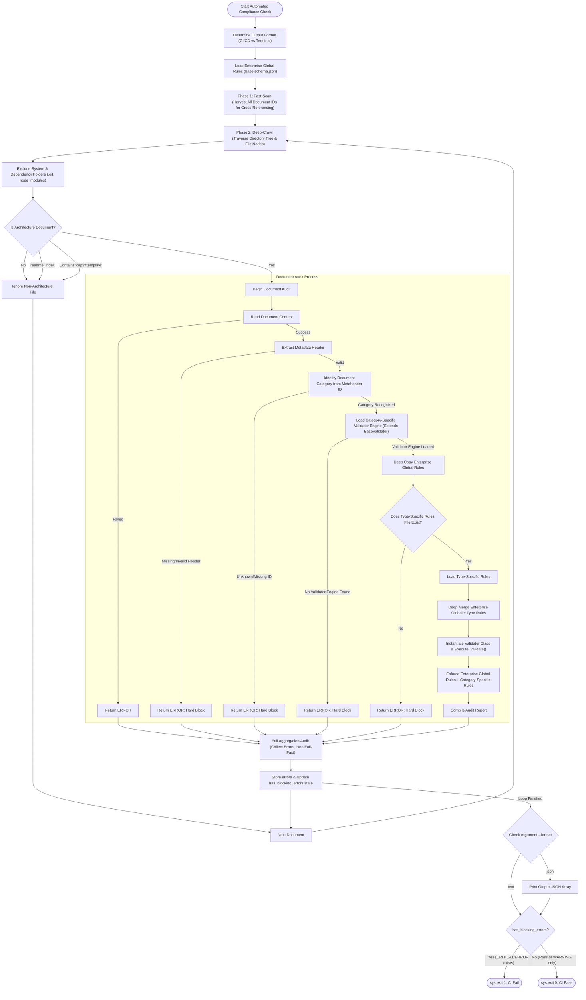
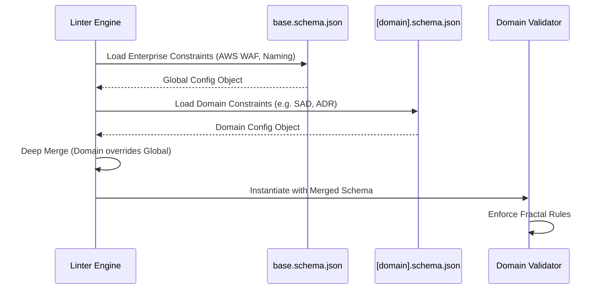
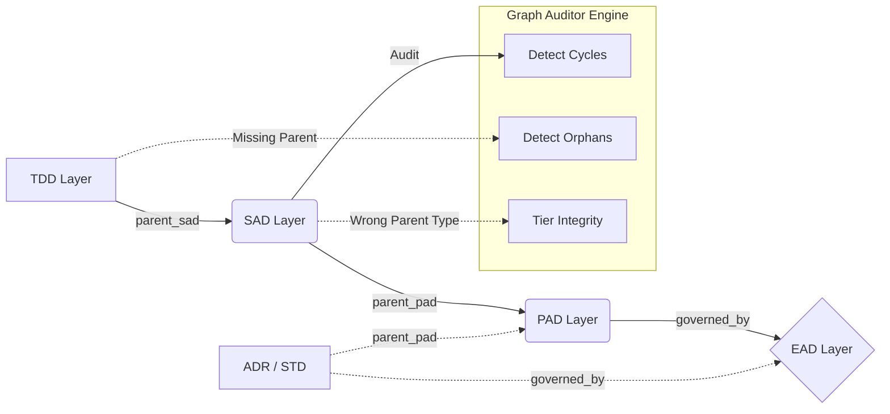
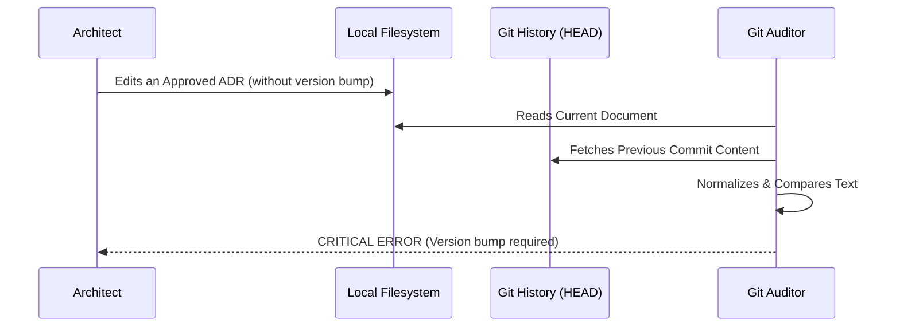

---
doc_meta:
  id: GDC-001
  title: Architecture Fitness Functions & Compliance Engine
  owner: Architecture Authority
  version: 0.1.1
  status: draft
  classification: public
  governed_by: [GDC-000]
  review_cycle_days: 365
  created_date: 2026-01-01
---

# Architecture Fitness Functions & Compliance Engine

## 1. Context & Scope

### 1.1 The Core Mandate: The Master Fitness Function

The **Master Fitness Function** is the central automated compliance engine designed to operationalize all five ecosystem goals established in the [Scnehaux Architectural Constitution](./GDC-0governance-policy.md#11-the-ecosystem-goals).

Rather than relying on manual, bottleneck-prone reviews, we enforce these goals through the philosophy of **Separation of Concerns (SoC) Artifact Domains**. We mandate that every architectural perimeter must be fully automatable. To achieve this, we centralize critical boundaries, taxonomies, and lineages into the document's YAML Frontmatter (`doc_meta`) and structural Abstract Syntax Tree (AST).

By transforming human-readable principles into mathematically verifiable constraints, the Master Fitness Function ensures that the architectural standards are enforced deterministically at the CI/CD boundary. It acts as a continuous, automated guardrail that preserves engineering quality without sacrificing speed.

### 1.2 The Automation Scope & Domain Boundaries

To fulfill the Constitution (GDC-000), we divide deterministic validation into five definitive architectural perimeters (The 5 Pillars). This list is the conceptual boundary for the control plane. Any new deterministic validation rule MUST fall into one of these domains, be owned by `engine/control/`, and remain invokable through the canonical `engine/control/linting` facade rather than being embedded in an interface or fitness harness:

1. **Topology & Identity Domain (Graph & Lineage)**
   Focuses on the identity of the artifact and how it connects to the ecosystem (C4 DAG). This ensures the architecture graph remains unbroken and non-overlapping.
   - **Ontology & Identity**: Enforces unique architectural IDs, preventing duplicates and floating nodes. _[Non-Leakage Policy](./GDC-0governance-policy.md#21-the-boundary-constraints-non-leakage-policy)_
   - **Traceability & Lineage**: Automates detection of circular references, missing parent attachments, and broken lineages. _[Contractual Lineage](./GDC-0governance-policy.md#23-contractual-lineage-the-c4-dag)_

2. **Structural Compliance Domain (Shape & Completeness)**
   Focuses on the physical shape and required completeness of the artifact, regardless of its subjective text content.
   - **Schema & Metadata Integrity**: Ensures the artifact is well-formed against its JSON/YAML schema and has complete frontmatter.
   - **Document Structure**: Enforces the existence of mandatory sections and their correct order.

3. **Semantic & Quality Domain (Meaning & Language)**
   Focuses on the editorial quality and semantic clarity of the architectural content.
   - **NFR Taxonomy Enforcement**: Enforces that non-functional requirements map strictly to AWS Well-Architected Framework pillars. _[NFR Taxonomy](./GDC-0governance-policy.md#24-non-functional-requirements-nfr-taxonomy)_
   - **Clarity & Objectivity**: Eradicates subjective terminology (e.g., "unquantified fast") and enforces clear, unambiguous claims. _[The Quality Framework](./GDC-0governance-policy.md#27-the-quality-framework)_

4. **Lifecycle & Environment Domain (Time, Space, & State)**
   Focuses on the artifact's status in time, its physical location, and its CI/CD lifecycle state.
   - **Temporal Governance**: Uses the system clock against dates to expire exception waivers and enforce review cycles. _[Waivers](./GDC-0governance-policy.md#210-architecture-exceptions-waivers)_
   - **Spatial Governance**: Enforces correct file naming and repository placement.
   - **Immutability Lock**: Requires explicit semantic version bumps for any modifications. _[Artifact Lifecycle & Versioning](./GDC-0governance-policy.md#25-artifact-lifecycle--versioning)_

5. **Architecture Constraints Domain (Hard Technical Limits)**
   Focuses on enforcing absolute enterprise technical decisions and security boundaries.
   - **Technology Boundaries**: Enforces enterprise-wide constraints against deprecated or unsafe tools.
   - **Security Boundaries**: Detects explicit violations of network and data isolation rules.

### 1.3 The Fractal Implementation Strategy

The deterministic control plane does not hardcode domains into a monolithic interface. It implements the [**Fractal Triad**](./GDC-0governance-policy.md#22-the-fractal-boundary-physical-vs-logical-decentralization) concept defined in the Constitution. `engine/control/linting` owns the canonical document-validation facade; validators, parsing, governance rules, and reporting remain deterministic control-plane collaborators.

At runtime, an invocation surface such as `engine/interfaces/cli.py` composes that facade with the foundational global policy (`schemas/base.schema.json` and `engine/control/validators/global_rules.py`). The control plane then combines the global policy with the document-specific triad requested by the artifact's `governed_by` metadata.

For example, if validating an SAD, it dynamically merges the global root with the SAD Triad:

1. **Guideline**: [`GDC-009-sad-guideline.md`](GDC-009-sad-guideline.md)
2. **Schema**: `schemas/sad.schema.json`
3. **Validator**: `engine/control/validators/domains/sad_validator.py`

> [!IMPORTANT]
>
> **The Executable Governance Philosophy**: Deterministic rules belong in schemas or control-plane code, but not every legitimate governance decision is mechanically decidable. **Every normative update to architecture governance MUST map to the canonical normative-control registry with an explicit enforcement mode, implementation mechanism, evidence state, and accountable owner when automation is not authoritative.** A Markdown statement without a closed policy → control → implementation → evidence chain is not an enforceable governance contract.

## 2. Policy Framework

The engine utilizes a decentralized, composable architecture based on the Open-Closed Principle. To contribute effectively, developers must first understand the physical layout of the engine.

### 2.1 The Fitness Function Ecosystem Topography (Physical Structure)

The production deterministic control plane resides under `engine/control/`. Its canonical linter facade is `engine/control/linting/`; invocation surfaces such as CLI, future API, MCP, Studio, and AI-assisted validation workflows compose that facade rather than owning validation semantics. `engine/interfaces/` owns those invocation boundaries.

`top-level framework tooling/` is a verification harness and support-tooling estate for gates, generators, scripts, fixtures, and tests of that tooling. It does not own product runtime. Product runtime tests live under `tests/` and follow source ownership.

> [!WARNING]
>
> **DO NOT EDIT THIS TREE MANUALLY.** This tree is generated from the live canonical source roots (`engine/`, `tests/`, and `top-level framework tooling/`) with deterministic exclusions for caches, scratch state, and packaging metadata. It intentionally does not depend on the Git index, so governance can describe the pre-Genesis working tree. Regenerate it with: `python generators/generate_engine_topography.py`

<!-- BEGIN_ENGINE_TOPOGRAPHY -->

```text
codex/
│   ├── engine/                  # (Product runtime)
│   │   ├── control/
│   │   │   ├── auditors/          # (External environment validators)
│   │   │   │   ├── dependency_scanner.py
│   │   │   │   ├── git_auditor.py
│   │   │   │   ├── governance_auditor.py
│   │   │   │   ├── graph_auditor.py
│   │   │   │   ├── registry_integrity_auditor.py
│   │   │   │   └── waiver_auditor.py
│   │   │   ├── config/            # (Engine configuration & environment variables)
│   │   │   │   ├── constants.py
│   │   │   │   ├── loader.py
│   │   │   │   └── severity.py
│   │   │   ├── framework/
│   │   │   │   └── compatibility.py
│   │   │   ├── fs/                # (File system utilities & workspace traversal)
│   │   │   │   └── crawler.py
│   │   │   ├── governance/
│   │   │   │   ├── classification.py
│   │   │   │   ├── committed_mutation.py
│   │   │   │   ├── controls.py
│   │   │   │   ├── genesis.py
│   │   │   │   ├── genesis_candidate.py
│   │   │   │   ├── lifecycle.py
│   │   │   │   ├── mutation.py
│   │   │   │   ├── readiness.py
│   │   │   │   ├── relationships.py
│   │   │   │   ├── scm_trust.py
│   │   │   │   ├── severity_enforcement.py
│   │   │   │   └── temporal.py
│   │   │   ├── INDEX.md
│   │   │   ├── linting/
│   │   │   │   └── facade.py
│   │   │   ├── parsing/           # (Data extraction from raw files)
│   │   │   │   └── markdown_ast.py
│   │   │   ├── rendering/
│   │   │   │   └── artifact.py
│   │   │   ├── reporting/         # (CLI output formatting & CI/CD error logs)
│   │   │   │   └── reporter.py
│   │   │   ├── repository/
│   │   │   │   └── assembler.py
│   │   │   ├── simulation/
│   │   │   │   ├── contracts.py
│   │   │   │   └── graph.py
│   │   │   ├── validation/
│   │   │   │   └── contracts.py
│   │   │   └── validators/        # (The core policy sandbox)
│   │   │       ├── base.py
│   │   │       ├── domains/       # (Federated domain-specific triad scripts)
│   │   │       │   ├── adr_validator.py
│   │   │       │   ├── ead_validator.py
│   │   │       │   ├── gdc_validator.py
│   │   │       │   ├── pad_validator.py
│   │   │       │   ├── sad_validator.py
│   │   │       │   ├── std_validator.py
│   │   │       │   └── tdd_validator.py
│   │   │       ├── global_rules.py # (Foundational Python rules for all documents)
│   │   │       ├── metadata_rules.py
│   │   │       ├── registry.py
│   │   │       ├── schema_extensions.py
│   │   │       └── structure_rules.py
│   │   ├── core/
│   │   │   ├── governance/
│   │   │   │   ├── approval.py
│   │   │   │   └── versioning.py
│   │   │   ├── knowledge/
│   │   │   │   ├── compiler.py
│   │   │   │   ├── context.py
│   │   │   │   ├── graph.py
│   │   │   │   ├── provenance.py
│   │   │   │   ├── reference.py
│   │   │   │   └── retrieval.py
│   │   │   ├── metamodel/
│   │   │   │   ├── artifact.py
│   │   │   │   └── document.py
│   │   │   └── repository/
│   │   │       └── model.py
│   │   ├── intelligence/
│   │   │   ├── planning/
│   │   │   │   └── contracts.py
│   │   │   ├── research/
│   │   │   │   └── contracts.py
│   │   │   ├── review/
│   │   │   │   └── contracts.py
│   │   │   └── synthesis/
│   │   │       └── contracts.py
│   │   └── interfaces/
│   │       └── cli.py            # (Fitness Function CLI Entrypoint)
│   ├── generators/              # (Dynamic docs and topography autobuilders)
│   │   ├── generate_adr_index.py
│   │   ├── generate_engine_topography.py
│   │   ├── generate_functions_doc.py
│   │   ├── generate_maturity_dashboard.py
│   │   ├── generate_pad_sad_index.py
│   │   ├── generate_rules_doc.py
│   │   ├── generate_traceability_graph.py
│   │   └── INDEX.md
│   ├── scripts/                 # (Git hooks and manual CI/CD utilities)
│   │   ├── codeowners-validator.py
│   │   ├── committed_mutation_integrity.py
│   │   ├── genesis_commit_qualify.py
│   │   ├── genesis_integrity.py
│   │   ├── github_policy_check.py
│   │   ├── governance_qualify.py
│   │   ├── INDEX.md
│   │   ├── install-hooks.py
│   │   ├── mutation_integrity.py
│   │   ├── prettier_runner.py
│   │   ├── scm_trust_boundary_check.py
│   │   └── waiver-expiry-check.py
│   └── tests/                   # (Product test estate)
│       ├── control/
│       │   ├── auditors/         # (External environment validators)
│       │   │   ├── test_dependency_scanner.py
│       │   │   ├── test_git_auditor.py
│       │   │   ├── test_governance_auditor.py
│       │   │   ├── test_graph_auditor.py
│       │   │   ├── test_registry_integrity_auditor.py
│       │   │   └── test_waiver_auditor.py
│       │   ├── config/           # (Engine configuration & environment variables)
│       │   │   └── test_loader.py
│       │   ├── framework/
│       │   │   └── test_ai_native_compatibility.py
│       │   ├── fs/               # (File system utilities & workspace traversal)
│       │   │   └── test_crawler.py
│       │   ├── governance/
│       │   │   ├── test_classification.py
│       │   │   ├── test_committed_mutation.py
│       │   │   ├── test_controls.py
│       │   │   ├── test_genesis.py
│       │   │   ├── test_genesis_candidate.py
│       │   │   ├── test_lifecycle.py
│       │   │   ├── test_mutation.py
│       │   │   ├── test_readiness.py
│       │   │   ├── test_relationships.py
│       │   │   ├── test_repository_text_policy.py
│       │   │   ├── test_scm_trust.py
│       │   │   ├── test_severity_enforcement.py
│       │   │   ├── test_severity_semantic_identity.py
│       │   │   └── test_temporal.py
│       │   ├── linting/
│       │   │   └── test_boundary.py
│       │   ├── parsing/          # (Data extraction from raw files)
│       │   │   ├── test_markdown_ast.py
│       │   │   └── test_semantic_parsing_boundary.py
│       │   ├── rendering/
│       │   │   ├── test_contract_boundary.py
│       │   │   └── test_roundtrip.py
│       │   ├── repository/
│       │   │   └── test_assembler.py
│       │   ├── simulation/
│       │   │   ├── test_contracts.py
│       │   │   └── test_graph.py
│       │   ├── validation/
│       │   │   └── test_contracts.py
│       │   └── validators/       # (The core policy sandbox)
│       │       ├── domains/      # (Federated domain-specific triad scripts)
│       │       │   ├── test_adr_validator.py
│       │       │   ├── test_all_domains.py
│       │       │   ├── test_ead_validator.py
│       │       │   ├── test_gdc_validator.py
│       │       │   ├── test_pad_validator.py
│       │       │   ├── test_sad_validator.py
│       │       │   ├── test_std_validator.py
│       │       │   └── test_tdd_validator.py
│       │       ├── test_base.py
│       │       ├── test_gdc_schema_lifecycle.py
│       │       ├── test_global_rules.py
│       │       ├── test_metadata_rules.py
│       │       ├── test_registry.py
│       │       ├── test_schema_extensions.py
│       │       └── test_structure_rules.py
│       ├── core/
│       │   ├── governance/
│       │   │   ├── test_approval.py
│       │   │   └── test_versioning.py
│       │   ├── knowledge/
│       │   │   ├── test_context.py
│       │   │   ├── test_foundation_boundary.py
│       │   │   ├── test_graph.py
│       │   │   ├── test_provenance.py
│       │   │   └── test_retrieval.py
│       │   ├── metamodel/
│       │   │   ├── test_artifact.py
│       │   │   └── test_framework_boundary.py
│       │   └── repository/
│       │       └── test_model.py
│       ├── generators/          # (Dynamic docs and topography autobuilders)
│       │   ├── test_adr_index_repository_model.py
│       │   ├── test_arch_generator_coverage_contracts.py
│       │   ├── test_generator_determinism.py
│       │   ├── test_maturity_dashboard_evidence.py
│       │   ├── test_pad_sad_index_repository_model.py
│       │   ├── test_support_generator_coverage_contracts.py
│       │   └── test_traceability_repository_model.py
│       ├── INDEX.md
│       ├── intelligence/
│       │   ├── conftest.py
│       │   ├── planning/
│       │   │   └── test_contracts.py
│       │   ├── research/
│       │   │   └── test_contracts.py
│       │   ├── review/
│       │   │   └── test_contracts.py
│       │   ├── synthesis/
│       │   │   └── test_contracts.py
│       │   └── test_contract_boundaries.py
│       ├── interfaces/
│       │   ├── test_cli.py
│       │   └── test_cli_extra.py
│       ├── scripts/             # (Git hooks and manual CI/CD utilities)
│       │   ├── test_committed_mutation_integrity.py
│       │   ├── test_genesis_commit_qualify.py
│       │   ├── test_genesis_integrity.py
│       │   ├── test_github_policy_check.py
│       │   ├── test_governance_qualify.py
│       │   ├── test_governance_scripts.py
│       │   ├── test_mutation_integrity.py
│       │   ├── test_prettier_runner.py
│       │   ├── test_prettier_runner_windows_quoting.py
│       │   ├── test_scm_trust_boundary_check.py
│       │   └── test_temporary_tool_hygiene.py
│       └── support/
│           ├── repository.py
│           └── validators.py
```

<!-- END_ENGINE_TOPOGRAPHY -->

### 2.2 The Ecosystem Capabilities (Functions & Scripts)

The table below maps the core engine auditor functions directly to the architecture enforcement policies.

The detailed Python function capabilities have been decentralized into their respective components to improve readability:

- [Engine Capabilities](../engine/control/INDEX.md)
- [Generators Capabilities](../generators/INDEX.md)
- [Scripts Capabilities](../scripts/INDEX.md)
- [Tests Capabilities](../tests/INDEX.md)

### 2.3 The Schema Architecture (JSON Federation)

The engine evaluates JSON Schema configuration files mapped by Document Type.

> [!NOTE]
>
> All JSON Schema files intentionally reside within the `schemas/` directory to keep them tightly coupled with the architecture documentation. This colocation makes it straightforward for contributors to edit rules side-by-side with their governing policies.

**Naming Convention Rule**: To achieve dynamic Deep-Merging of the [**Fractal Triad**](./GDC-0governance-policy.md#222-logical-decentralization-the-fractal-triad), the engine automatically identifies the necessary document-specific schema by extracting the Document Type prefix from the artifact's `doc_meta.id` (e.g., `ADR-IAM-000` -> `ADR`). It then resolves the specific JSON schema file by mapping it to the strict naming convention: `schemas/[doc_type].schema.json` (where `[doc_type]` is the exact acronym in lowercase, e.g., `schemas/adr.schema.json`). If a specific schema is required but missing, the engine MUST trigger a Hard Block.

| Document Type                | Ruleset File                     | Scope / Responsibilities                                                                                                                                                                                                                                                                                                                                                                                             |
| :--------------------------- | :------------------------------- | :------------------------------------------------------------------------------------------------------------------------------------------------------------------------------------------------------------------------------------------------------------------------------------------------------------------------------------------------------------------------------------------------------------------- |
| **Global Baseline**          | `schemas/base.schema.json`       | The universal parent. Enforces generic syntax, minimum word counts, banned vocabulary, and overarching layout structures.                                                                                                                                                                                                                                                                                            |
| **Domain-Specific Rulesets** | `schemas/[doc_type].schema.json` | To adhere to the Open-Closed Principle, domain-specific JSON schemas are documented exclusively within their respective guidelines:<br>• [GDC](GDC-005-gdc-guideline.md)<br>• [EAD](GDC-006-ead-guideline.md)<br>• [STD](GDC-007-std-guideline.md)<br>• [PAD](GDC-008-pad-guideline.md)<br>• [SAD](GDC-009-sad-guideline.md)<br>• [ADR](GDC-010-adr-guideline.md)<br>• [TDD](GDC-011-tdd-guideline.md) |

#### 2.3.1 Global Baseline Rules (`schemas/base.schema.json`)

The global baseline applies universally to all architecture documents across the repository to ensure foundational quality.

> [!WARNING]
>
> **DO NOT EDIT THIS TABLE MANUALLY.** This table is automatically generated from the JSON Schema (`schemas/base.schema.json`). If you need to update a rule, modify the schema file and run: `python generators/generate_rules_doc.py`

<!-- lint_disable_start: prohibited_words (reason: governance engine documentation) -->
<!-- AUTO-GENERATED-RULES:START -->

| Rule Category       | Parameter                                                  | Enforcement / Value                                                                                                                                                                                                                                                                                                                                                                                                                                                                                                                      |
| :------------------ | :--------------------------------------------------------- | :--------------------------------------------------------------------------------------------------------------------------------------------------------------------------------------------------------------------------------------------------------------------------------------------------------------------------------------------------------------------------------------------------------------------------------------------------------------------------------------------------------------------------------------- |
| **Structure Rules** | Artifact Directories                                       | **Gdc**: `governance`<br>**Ead**: `enterprise`<br>**Std**: `standards`<br>**Pad**: `domains`<br>**Sad**: `systems`<br>**Adr**: `decisions`<br>**Tdd**: `designs`                                                                                                                                                                                                                                                                                                                                                                         |
| **Structure Rules** | Ignored Files                                              | **Exact Matches**: <ul><li>`readme.md`</li><li>`index.md`</li><li>`contributing.md`</li><li>`changelog.md`</li><li>`maturity.md`</li><li>`traceability.md`</li></ul><br>**Patterns**: <ul><li>`[\\/]templates[\\/]`</li><li>`[\\/]scratch[\\/]`</li></ul>                                                                                                                                                                                                                                                                                |
| **Structure Rules** | Max Directory Depth                                        | `3`                                                                                                                                                                                                                                                                                                                                                                                                                                                                                                                                      |
| **Content Rules**   | Max Review Age Days                                        | **Value**: `365`<br>**Error Message**: `Document review age of {age_days} days exceeds limit of {limit} days.`                                                                                                                                                                                                                                                                                                                                                                                                                           |
| **Content Rules**   | Min Content Length Chars                                   | **Value**: `50`<br>**Error Message**: `Section '{section_name}' content length ({length} chars) is below minimum of {min_length} chars.`                                                                                                                                                                                                                                                                                                                                                                                                 |
| **Content Rules**   | Prohibited Words                                           | **Patterns**: <ul><li>`\bmaybe\b`</li><li>`\bprobably\b`</li><li>`\bshould consider\b`</li><li>`\bTBD\b`</li><li>`\bcoming soon\b`</li><li>`\band so on\b`</li><li>`\bseamless(?:ly)?\b`</li><li>`\bobviously\b`</li><li>`\bblazingly\b`</li><li>`\btrivially\b`</li></ul><br>**Error Message**: `Prohibited boilerplate or hesitant word detected. Use definitive, professional language.`                                                                                                                                              |
| **Content Rules**   | Ambiguity Rules                                            | **Patterns**: <ul><li>`\b(highly\|very\|extremely\|super\|incredibly)\s+(scalable\|fast\|secure\|reliable\|available\|performant\|robust\|efficient)\b`</li></ul><br>**Error Message**: `Vague claim detected. Must be quantified with metrics.`                                                                                                                                                                                                                                                                                         |
| **Severity Levels** | 0. Engine Execution Domain (System Fatality)               | **Unreadable Artifact**: `CRITICAL`<br>**Corrupt Frontmatter**: `CRITICAL`<br>**Unknown Document Type**: `CRITICAL`<br>**Missing Validator**: `CRITICAL`<br>**Invalid Lint Disable**: `ERROR`                                                                                                                                                                                                                                                                                                                                            |
| **Severity Levels** | 1. Topology & Identity Domain (Graph & Lineage)            | **Circular Dependency**: `CRITICAL`<br>**Cross Reference Missing**: `ERROR`<br>**Duplicate Id**: `CRITICAL`<br>**Inline Reference Missing**: `WARNING`<br>**Orphan Document**: `ERROR`<br>**Traceability Violation**: `ERROR`<br>**Broken Internal Link**: `ERROR`                                                                                                                                                                                                                                                                       |
| **Severity Levels** | 2. Structural Compliance Domain (Shape & Completeness)     | **Missing Metadata**: `ERROR`<br>**Missing Required Subsection**: `ERROR`<br>**Missing Section**: `ERROR`<br>**Missing Section Keyword**: `ERROR`<br>**Schema Validation Failed**: `CRITICAL`<br>**Subsection Order Violation**: `WARNING`                                                                                                                                                                                                                                                                                               |
| **Severity Levels** | 3. Semantic & Quality Domain (Meaning & Language)          | **Ambiguity Rules**: `WARNING`<br>**Nfr Taxonomy Violation**: `ERROR`<br>**Prohibited Words**: `ERROR`<br>**Structural Integrity Violation**: `CRITICAL`<br>**Stylistic Deviation**: `WARNING`                                                                                                                                                                                                                                                                                                                                           |
| **Severity Levels** | 4. Lifecycle & Environment Domain (Time, Space, & State)   | **Approved Version Not Stable**: `ERROR`<br>**Compliance Filename Match**: `ERROR`<br>**Compliance Macro Directory**: `ERROR`<br>**Exception Expired**: `ERROR`<br>**Review Age Violation**: `WARNING`<br>**Version Bump Required**: `ERROR`<br>**Architecture Admission Violation**: `CRITICAL`<br>**Lifecycle Age Violation**: `ERROR`<br>**Relaxed Validation Applied**: `INFO`<br>**Temporal Integrity Violation**: `ERROR`<br>**Repository Classification Violation**: `CRITICAL`<br>**Repository Visibility Mismatch**: `CRITICAL` |
| **Severity Levels** | 5. Architecture Constraints Domain (Hard Technical Limits) | **Operational Stability Violation**: `ERROR`<br>**Technology Hold Violation**: `CRITICAL`<br>**Unapproved Technology**: `ERROR`<br>**Technology Policy Unavailable**: `CRITICAL`                                                                                                                                                                                                                                                                                                                                                         |
| **Governance**      | Blocking Severities                                        | `['CRITICAL', 'ERROR']`                                                                                                                                                                                                                                                                                                                                                                                                                                                                                                                  |

### Severity Levels

#### 0. Engine Execution Domain (System Fatality)

| Error Code              | Severity (CI Action) |
| :---------------------- | :------------------- |
| `unreadable_artifact`   | **CRITICAL**         |
| `corrupt_frontmatter`   | **CRITICAL**         |
| `unknown_document_type` | **CRITICAL**         |
| `missing_validator`     | **CRITICAL**         |
| `invalid_lint_disable`  | **ERROR**            |

#### 1. Topology & Identity Domain (Graph & Lineage)

| Error Code                 | Severity (CI Action) |
| :------------------------- | :------------------- |
| `circular_dependency`      | **CRITICAL**         |
| `cross_reference_missing`  | **ERROR**            |
| `duplicate_id`             | **CRITICAL**         |
| `inline_reference_missing` | **WARNING**          |
| `orphan_document`          | **ERROR**            |
| `traceability_violation`   | **ERROR**            |
| `broken_internal_link`     | **ERROR**            |

#### 2. Structural Compliance Domain (Shape & Completeness)

| Error Code                    | Severity (CI Action) |
| :---------------------------- | :------------------- |
| `missing_metadata`            | **ERROR**            |
| `missing_required_subsection` | **ERROR**            |
| `missing_section`             | **ERROR**            |
| `missing_section_keyword`     | **ERROR**            |
| `schema_validation_failed`    | **CRITICAL**         |
| `subsection_order_violation`  | **WARNING**          |

#### 3. Semantic & Quality Domain (Meaning & Language)

| Error Code                       | Severity (CI Action) |
| :------------------------------- | :------------------- |
| `ambiguity_rules`                | **WARNING**          |
| `nfr_taxonomy_violation`         | **ERROR**            |
| `prohibited_words`               | **ERROR**            |
| `structural_integrity_violation` | **CRITICAL**         |
| `stylistic_deviation`            | **WARNING**          |

#### 4. Lifecycle & Environment Domain (Time, Space, & State)

| Error Code                            | Severity (CI Action) |
| :------------------------------------ | :------------------- |
| `approved_version_not_stable`         | **ERROR**            |
| `compliance_filename_match`           | **ERROR**            |
| `compliance_macro_directory`          | **ERROR**            |
| `exception_expired`                   | **ERROR**            |
| `review_age_violation`                | **WARNING**          |
| `version_bump_required`               | **ERROR**            |
| `architecture_admission_violation`    | **CRITICAL**         |
| `lifecycle_age_violation`             | **ERROR**            |
| `relaxed_validation_applied`          | **INFO**             |
| `temporal_integrity_violation`        | **ERROR**            |
| `repository_classification_violation` | **CRITICAL**         |
| `repository_visibility_mismatch`      | **CRITICAL**         |

#### 5. Architecture Constraints Domain (Hard Technical Limits)

| Error Code                        | Severity (CI Action) |
| :-------------------------------- | :------------------- |
| `operational_stability_violation` | **ERROR**            |
| `technology_hold_violation`       | **CRITICAL**         |
| `unapproved_technology`           | **ERROR**            |
| `technology_policy_unavailable`   | **CRITICAL**         |

| Rule Category              | Parameter              | Enforcement / Value                                                                                        |
| :------------------------- | :--------------------- | :--------------------------------------------------------------------------------------------------------- |
| **Common Metadata Fields** | Common Metadata Fields | <ul><li>id (string)</li><li>title (string)</li><li>status (string)</li><li>created_date (string)</li></ul> |

<!-- AUTO-GENERATED-RULES:END -->
<!-- lint_disable_end: prohibited_words -->

#### 2.3.2 The Universal Schema Generator

To maintain the "Docs-as-Code" philosophy, all JSON Schema constraints are automatically mapped into human-readable Markdown tables across the GDC documents. This is handled by the Universal Schema Generator (`generators/generate_rules_doc.py`).

The generator is capable of mapping complex JSON Schema constructs:

1. **Dynamic Conditionals (`allOf` + `if`/`then`)**: Automatically detects conditional schema branches and dynamically annotates the required sections (e.g., extracting `const: EAD-EXAMPLE-001` to display conditional requirements explicitly in the tables).
2. **Title Overrides (`x-titles`)**: Uses the `x-titles` metadata to override raw JSON property keys with highly descriptive, human-readable column parameters.
3. **Regex Extraction (`pattern`)**: Strips down complex regex string enforcements into clean, readable keywords.
4. **Soft vs Hard Enforcement (`recommended` vs `required`)**: Explicitly partitions and tags keywords that are strictly required (`required`) versus those that are best-practice (`recommended`).

### 2.4 Validator Federation (Polymorphic Engine)

The Validator Federation is composed by the deterministic linter facade in `engine/control/linting/`. JSON schemas provide static declarative constraints, while specialized validators under `engine/control/validators/` provide deterministic document-specific behavior. `engine/interfaces/cli.py` is an invocation adapter: it may compose the facade, but it does not own validator semantics.

**Naming Convention Rule**: To enforce the [**Fractal Triad**](./GDC-0governance-policy.md#222-logical-decentralization-the-fractal-triad), the `engine/control/validators/registry.py` automatically maps the artifact to its validator by extracting the Document Type prefix from the artifact's `doc_meta.id` (e.g., `ADR-IAM-000` -> `ADR`). It then attempts to load the validator class using the strict naming convention: `[DocType]Validator` (e.g., `ADRValidator`), which must reside in the python file `engine/control/validators/domains/[doc_type]_validator.py` (lowercase, e.g., `engine/control/validators/domains/adr_validator.py`). If the registry fails to find a validator for an expected Document Type, the engine MUST trigger a Hard Block.

**Execution Isolation (`validate_type_specific`)**: To guarantee clean Separation of Concerns (SoC), global rules (e.g., checking mandatory sections, banned vocabulary) are handled entirely by the parent `BaseValidator`. The specialized child classes (like `ADRValidator` or `SADValidator`) are strictly prohibited from implementing global logic. They MUST isolate their custom domain-logic entirely within the overridden `validate_type_specific()` function. This function serves as the exclusive sandbox for executing document-specific rules.

The architecture of the engine is divided into two primary domains:

1. **The Validator Federation** (Sections 2.4.1 - 2.4.2): Dedicated Python classes extending the `BaseValidator` to enforce domain-specific logic.
2. **Core Framework Dependencies** (Section 2.4.3): Utility modules that provide foundational support (parsing, type-safety, and registry scanning) to the federation.

#### 2.4.1 `BaseValidator` (`engine/control/validators/base.py`)

The abstract parent class. Executes the merged JSON schema, handles global errors, and dictates severity.

| Function / Property Signature                                                                 | Responsibilities & Logic                                                                                                                                                                                       |
| :-------------------------------------------------------------------------------------------- | :------------------------------------------------------------------------------------------------------------------------------------------------------------------------------------------------------------- |
| **Instance Variables**                                                                        | `file_path`, `content`, `doc_meta`, `rules`, `all_doc_ids`, `errors`, `rel_path`, `filename`, `disabled_rules`                                                                                                 |
| `@property`<br>`mandatory_sections(self)`                                                     | Retrieves `rules.structure.required_sections` from the JSON rules.                                                                                                                                             |
| `@property`<br>`optional_sections(self)`                                                      | Retrieves `rules.structure.optional_sections` from the JSON rules.                                                                                                                                             |
| `@property`<br>`required_metadata_fields(self)`                                               | Retrieves `rules.metadata.required_fields` from the JSON rules.                                                                                                                                                |
| `__init__(self, file_path: str, content: str, doc_meta: dict, rules: dict, all_doc_ids: set)` | Instantiates the context variables. Parses `<!-- lint_disable: rule_name, rule_name -->` HTML comments in `content` to populate the `disabled_rules` set.                                                      |
| `add_error(self, category: str, message: str)`                                                | Evaluates if `category` exists in `disabled_rules`. If not, maps the category to a severity using `severity_levels` in the schema (defaults to `'ERROR'`), and appends `(severity, message)` to `self.errors`. |
| `validate(self) -> list[tuple[str, str]]`                                                     | Orchestrates the execution: triggers `run_common_validations(self)` from `global_rules.py`, invokes `self.validate_type_specific()`, and returns `self.errors`.                                                |
| `validate_type_specific(self)`                                                                | Abstract interface intended to be overridden by child classes for domain isolation (`pass` by default).                                                                                                        |

#### 2.4.2 Domain-Specific Validators

To adhere to the Open-Closed Principle, domain-specific Python logic (the `validate_type_specific` implementation) is documented exclusively within their respective guidelines:

- [GDC](GDC-005-gdc-guideline.md) (`engine/control/validators/domains/gdc_validator.py`)
- [EAD](GDC-006-ead-guideline.md) (`engine/control/validators/domains/ead_validator.py`)
- [STD](GDC-007-std-guideline.md) (`engine/control/validators/domains/std_validator.py`)
- [PAD](GDC-008-pad-guideline.md) (`engine/control/validators/domains/pad_validator.py`)
- [SAD](GDC-009-sad-guideline.md) (`engine/control/validators/domains/sad_validator.py`)
- [ADR](GDC-010-adr-guideline.md) (`engine/control/validators/domains/adr_validator.py`)
- [TDD](GDC-011-tdd-guideline.md) (`engine/control/validators/domains/tdd_validator.py`)

#### 2.4.3 Core Framework Dependencies

The `engine/` directory contains critical utility modules that power the core Engine, providing AST parsing, global schema validation, and cross-reference resolutions.

| Component         | File                                       | Responsibilities & Logic                                                                                                                                                                                                                                                                                                                                                                                                   |
| :---------------- | :----------------------------------------- | :------------------------------------------------------------------------------------------------------------------------------------------------------------------------------------------------------------------------------------------------------------------------------------------------------------------------------------------------------------------------------------------------------------------------- |
| **Crawler**       | `engine/fs/crawler.py`                     | **Fast-Scan Phase**: Recursively walks the repository to build a global registry of all valid document IDs (by extracting `doc_meta.id`). This registry is injected into the validators to guarantee cross-reference integrity (e.g., ensuring `fulfilled_by` or `parent_pad` points to existing documents). It additionally detects **duplicate IDs** (SSOT uniqueness violations) rather than silently overwriting them. |
| **Config Loader** | `engine/config/loader.py`                  | **Type-Safety Enforcement**: Utilizes `jsonschema` to strictly cast and validate the `doc_meta` block against the deep-merged `.schema.json` configurations. Features include enforcing strict Semantic Versioning (`X.Y.Z`) on the `version` field and guaranteeing schema constraints for nested objects.                                                                                                                |
| **AST Parser**    | `engine/parsing/markdown_ast.py`           | **AST Processing**: Uses `markdown_it` to tokenize the markdown into an Abstract Syntax Tree (AST). Provides modular functions to accurately extract section content, strip styling for character counts, harvest `href` links, strip code fences/inline code for safe directive parsing, harvest inline ID citations, and normalize YAML `datetime` values.                                                               |
| **Graph Auditor** | `engine/control/auditors/graph_auditor.py` | **Graph Audit**: Builds the upward-reference graph (`parent_pad` / `parent_sad` / `governed_by`) across the full registry once per run. It detects circular dependencies and enforces C4-tier strict attachments (e.g., TDD must attach to SAD).                                                                                                                                                                           |
| **Git Auditor**   | `engine/control/auditors/git_auditor.py`   | **Immutability Lock**: Interfaces directly with `git HEAD` to extract the historical status of a document. Enforces that any document that has already achieved `approved` status cannot be modified structurally without a mandatory `version` bump.                                                                                                                                                                      |

### 2.3 Inline Policy Exemptions (`lint_disable`)

A `lint_disable` directive suppresses a specific **non-blocking** finding on a document, and should carry a reason:

```html
<!-- lint_disable: vague_claim, prohibited_word (reason: ARB waiver per ADR-GLB-009) -->
```

The directive is **governed** — it is not an unconditional override:

1. **CRITICAL findings cannot be silenced.** A directive targeting a `CRITICAL`-severity category (e.g. `structural_integrity_violation`, `security isolation control violation`, `technology_hold_violation`) is _rejected_: the finding still fires, and the attempt is recorded in the CI audit under **Rejected Disables**.
2. **Code is not a directive.** Directives inside fenced code blocks or inline code spans are ignored, so documentation _examples_ of `lint_disable` are never parsed as live suppressions.
3. **Reasons are captured.** A directive lacking a `(reason: …)` clause is reported as `UNDOCUMENTED` in the audit summary for reviewer scrutiny.

All honored and rejected disables are collected and printed in the final CI audit summary.

### 2.4 NFR Taxonomy Enforcement (AWS WAF)

To ensure non-functional requirements are structured uniformly across all systems, the engine enforces strict mapping to the AWS Well-Architected Framework. Any NFRs declared in architecture documents must be categorized under one of the 6 pillars (e.g., `### Security`, `### Reliability`). The `engine/control/validators/global_rules.py` module evaluates the headers under the "Non-Functional Requirements" section to guarantee alignment with `aws_waf_pillars` defined in the global schema.

### 2.5 Artifact Lifecycle & Immutability Lock

Once an architectural decision (such as an ADR) reaches the `approved` status, it enters an immutable state. The `engine/control/auditors/git_auditor.py` intercepts any modifications to approved documents by comparing the local file against `git HEAD`. If structural or content modifications are detected, the engine raises a `CRITICAL` violation unless the `version` metadata is explicitly incremented, establishing a verifiable chain of custody for all historical decisions.

> [!IMPORTANT]
>
> **SSOT is machine-enforced.** The reconciliation between the JSON schemas and their generated Markdown tables is verified in CI by `python generators/generate_rules_doc.py --check`, which fails the build on any drift. Synchronization is guaranteed by the pipeline, not by convention.

### 2.4 Lifecycle-Aware Validation Profiles

The Fitness Function MUST resolve document type before applying any lifecycle-based validation shortcut. Lifecycle state does not select validation strictness by itself.

`full_validation_doc_types` is the declarative control for document types that always execute complete schema, global-rule, domain-validator, and repository-audit validation. GDC is in this set.

| Document Type / State        | Validation Profile | Meaning                                                                |
| ---------------------------- | ------------------ | ---------------------------------------------------------------------- |
| `GDC` + `draft`              | **Full**           | Governance Control Plane is evolving but must govern itself rigorously |
| `GDC` + `approved`           | **Full**           | Stable enforceable governance baseline                                 |
| Eligible downstream `draft`  | **Relaxed**        | Early collaboration within bounded age limits                          |
| Non-eligible lifecycle state | **Full**           | Normal governance execution                                            |

The repository-level architecture-admission audit reads `governance/bootstrap-manifest.yaml`. `architecture_admission: closed` hard-blocks EAD, STD, PAD, SAD, ADR, and TDD instances. `architecture_admission: open` is valid only when every declared `required_baseline_id` is present, `approved`, and versioned at `1.0.0` or higher.

### Per-File Test Coverage Contract

The Fitness Function implementation is governed by a **per-file statement coverage floor of 95%** for every production Python source file under `engine/control/`. Repository-wide average coverage is retained only as a secondary defense-in-depth metric and MUST NOT compensate for an individual file below the threshold.

The canonical `python -m pytest` command enforces both contracts:

- aggregate statement coverage MUST be at least 95%
- every individual production source file MUST be at least 95%
- any single file below 95% fails the test session and therefore blocks governance admission

The threshold is declared in `pyproject.toml` under `[tool.scnehaux.coverage]` and consumed by the pytest governance hook. This prevents high-coverage utility modules from masking untested control-plane code in critical files such as auditors, schema loaders, validators, or the CLI orchestrator.

### Dead Code and Coverage Integrity

Production code under `engine/control/` MUST NOT retain unreachable functions, branches, commented-out implementations, or compatibility paths that cannot occur under the repository's enforced invariants.

Coverage MUST represent executable production behavior:

- unreachable production code is deleted or refactored rather than covered by artificial tests
- tests MUST exercise reachable contracts, failure modes, and supported configurations
- commented-out historical implementations are prohibited in active source files; Git history is the archival mechanism
- entrypoint and defensive behavior that remains reachable MAY remain uncovered provided every source file still satisfies the 95% per-file floor
- an increase in coverage that exists only because a test invokes otherwise unused production code is not considered a quality improvement

## 3. Technology Lifecycle Governance

The compliance engine enforces the enterprise **Technology Radar** (`tech-radar.yaml`) and **Standards Maturity Model**. The authoritative policies — maturity phases, sunset strategy, applicability criteria, and exception waiver procedures — are defined and maintained in **[GDC-004 — Technology Lifecycle & Standards Governance](GDC-004-tech-lifecycle.md)**.

This section documents only the **automated enforcement mechanics** that GDC-001 provides to execute those policies:

### 3.1 Automated Hold Enforcement

The linter automatically rejects any Pull Request containing references to technologies that have reached the `Hold` phase and exceeded their grace window. This triggers a `technology_hold_violation` at `CRITICAL` severity, producing a Hard CI Block (Exit 1). The 3-Stage Sunset Strategy (recommendation → grace window → hard block) is defined in [GDC-004 §2.2](GDC-004-tech-lifecycle.md).

### 3.2 Automated Waiver Expiration

The CI engine performs temporal validation on Exception ADRs. If an `accepted` waiver ADR reaches its `expiry_date`, the linter triggers a Hard CI Block with an `exception_expired` ERROR. The procedural resolution paths (resolve debt, evolve standard, or renew waiver) are defined in [GDC-004 §4.2](GDC-004-tech-lifecycle.md) and [GDC-010 §2.4.3](GDC-010-adr-guideline.md).

## 4. Severity & Exception Waivers

The authoritative definitions for applicability criteria and the exception waiver procedure are maintained in **[GDC-004 §4](GDC-004-tech-lifecycle.md)**. The approval authority matrix, time-bound review commitments, and auditing rules live there as the single source of truth.

GDC-001's role is enforcement: the engine validates waiver metadata (`approved_by`, `expiry_date`, `risk_classification`) against the schema defined in `schemas/adr.schema.json` and executes the temporal checks described in §3.2 above.

## 5. Linter Execution Flow (CI/CD Automated Gate)

The CLI invocation is orchestrated by `engine/interfaces/cli.py`, while document-level deterministic validation is owned by the `engine/control/linting` facade. Other invocation surfaces may compose the same control facade without duplicating or bypassing its semantics. The diagram below illustrates the current CLI execution flow:



### 5.1 Zoom-In: Deep-Merge Configuration Workflow

The linter utilizes a fractal schema strategy. To maintain OCP (Open-Closed Principle), domain-specific rules are not hardcoded into the global engine.



### 5.2 Zoom-In: Traceability Graph & Orphan Audit

Traceability is not verified locally per-file; it requires a repository-wide C4-tier graph resolution.



### 5.3 Zoom-In: Git-Aware Version Bump Mandate

Once an architectural decision is approved, it becomes immutable. Any further modifications require an explicit version bump to ensure downstream dependents are aware of the change.



## 6. Compliance & Enforcement

1. **Commit Hook Checks**: Pre-commit hooks must scan new architecture documents (e.g., ADRs) to verify that the YAML frontmatter contains valid fields and matches the schema defined in their respective guidelines.
2. **Conditional Schema Validation**: The CI linter dynamically shifts its validation rules based on domain-specific attributes delegated to the respective guideline validators.
3. **Domain-Specific Lifecycle Enforcement**: The CI pipeline executes lifecycle and temporal logic as explicitly defined in downstream domain guidelines (e.g., executing exception mechanisms as delegated by GDC-010).
4. **Distributed Enforcement (Remote Execution)**: Downstream project repositories (containing C3/C4 artifacts) MUST NOT maintain their own copies of `engine/interfaces/cli.py`. To ensure strict, untamperable governance, local CI/CD pipelines must validate documents by remotely executing the central linter.

### 6.1 Execution Boundary & Path Sterilization (Fail-Closed Security)

To prevent Path Traversal vulnerabilities and ensure absolute validation integrity, the Master Fitness Function implements strict execution boundaries:

1. **CWD Anchoring (`TARGET_REPO_ROOT`)**: The execution root is strictly defined by the Current Working Directory (CWD). The linter will automatically reject execution if the CWD is not a valid repository root (lacking a `.git` marker).
2. **Path Boundary Enforcement**: Any target path explicitly provided to the linter (e.g., via CLI arguments) MUST resolve within the `TARGET_REPO_ROOT`. Attempts to traverse outside the repository (e.g., using `..` or targeting a different drive volume) will trigger an immediate **Hard Crash (`sys.exit(1)`)**.
3. **Directory Sterilization**: When traversing the repository, the crawler strictly sterilizes the filesystem tree. It will aggressively prune any directories that do not explicitly match the `artifact_directories` schema defined in `base.schema.json`.
4. **Fail-Closed Execution**: The linter is strictly a "Fail-Closed" security system. Boundary violations DO NOT result in skipped files with a passing (`0`) exit code. All violations result in a fatal `CRITICAL` error to prevent unvalidated files from silently bypassing CI/CD checks.

### 6.2 Downstream Integration (Remote Execution)

To prevent security vulnerabilities and local tampering, downstream repositories (e.g., `scnehaux-ui-platform`) must remotely invoke this Compliance Engine during their CI/CD runs.

**Option A: Reusable GitHub Workflow (Recommended)** Reference the central linter directly in your local `.github/workflows/lint.yml`:

```yaml
jobs:
  architecture-lint:
    uses: scnehaux/codex/.github/workflows/linter.yml@main
```

> [!TIP] **Testing Linter Upgrades in Downstream Repositories** By default, the workflow executes the linter script from the `main` branch. If you are developing a new linter rule in a branch (e.g., `feature/strict-nfr`) inside the governance repository and need to test it against your downstream application code, you must override the `governance_ref` input:
>
> ```yaml
> jobs:
>   architecture-lint:
>     uses: scnehaux/codex/.github/workflows/linter.yml@feature/strict-nfr
>     with:
>       governance_ref: "feature/strict-nfr"
> ```

**Option B: Centralized Docker Image** Execute the immutable, centrally-published linter image against your local directory:

```bash
docker run --rm -v $(pwd):/docs ghcr.io/scnehaux/gdc-linter:latest
```

---

## 7. Appendix: Architectural Trade-Offs

In accordance with the Quality Rubric (Trade-Offs parameter), the ARB explicitly documents the technical compromises of this Fitness Function & Compliance Engine:

1. **Custom Python Linter vs. Spectral / Checkov**
   - _Why rejected_: Spectral is excellent for OpenAPI, and Checkov is standard for IaC, but neither natively supports complex Markdown AST parsing intertwined with dynamic YAML deep-merging based on custom ID prefixes.
   - _The Trade-Off_: We incur the ongoing maintenance burden of owning a custom Python CLI (`engine/interfaces/cli.py`). In exchange, we gain absolute control over the Open-Closed Principle (OCP) dynamic validator loading, enabling complex cross-document hyperlink resolution and federated governance.
2. **180-Day Sunset Grace Period vs. Immediate Deprecation**
   - _Why rejected_: Immediate deprecation halts all product delivery, forcing teams into unplanned emergency migrations and jeopardizing business roadmaps.
   - _The Trade-Off_: We consciously accept the security and maintenance risk of running obsolete technology for up to 180 days. In exchange, we provide engineering teams a predictable, humane runway to schedule their technical debt payoff without halting feature velocity.
